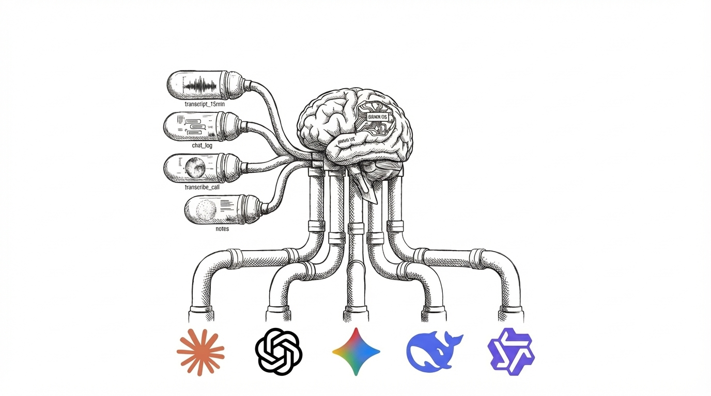

# Brain OS: A Memory-Based Operating System for Project Intelligence

## 1. Executive Summary
Brain OS is a cognitive infrastructure designed to transition the role of the human from a manager of details to a director of outcomes. By utilizing a memory-first architecture, the system offloads technical thinking, administrative tracking, and routine analysis to an AI agent. The human remains the central authority for navigation, brand identity, and final validation.

## 2. Memory Architecture: Bubbles and Clouds
The system organizes information into two distinct layers that mimic human episodic and semantic memory.

### 2.1 Bubbles (Episodic Memory)
Bubbles are the atomic units of the system. They represent raw, timestamped moments of experience.
*   **Ingestion:** Created primarily through unstructured data dumps, such as 15-minute transcripts, chat logs, or notes.
*   **Characteristics:** Each Bubble contains specific content, a timestamp, and a source reference.
*   **Function:** They preserve the "what" and "when" of a project without interpretation.

### 2.2 Clouds (Synthetic Memory)
Clouds represent the system’s understanding or hypotheses derived from clusters of Bubbles.
*   **Synthesis:** The AI analyzes multiple Bubbles to identify patterns, risks, or shifts in priority.
*   **Hypothesis State:** A Cloud begins as a pending state, which is a theory the AI has about your work.
*   **Validation:** Once the human confirms a Cloud, it solidifies into a confirmed understanding and becomes a permanent guideline for future agent behavior.

### 2.3 Connections (Neural Mapping)
Connections are the relational links between Bubbles and Clouds.
*   **Auto-Discovery:** The system identifies resonance between projects, such as recognizing that a technical solution for Project A is applicable to Project B.
*   **Dependency Tracking:** The system automatically links a blocker bubble to the resolution bubble that clears it.

## 3. The Creative Partner: The Human-AI Interface
The Creative Partner is the active interface through which the human interacts with Brain OS. It is exposed via MCP tools to allow for seamless integration within the chat environment.

### 3.1 Collaborative Ideation
Instead of a standard search, the Creative Partner pulls from the living context of Bubbles and Clouds to provide answers that are grounded in your specific history and project constraints.

### 3.2 Constructive Friction
The Partner is programmed to challenge the human. If a new requirement contradicts an established project goal, the Partner flags the inconsistency to prevent scope creep or architectural regression.

## 4. The Division of Labor: Human vs. Brain OS
Brain OS establishes a clear separation of concerns between the human Brand and the AI Engine.

### 4.1 The Human Role (The Brand)
The human is the Brand Owner and provides the essential "Why" and "What."
*   **Navigation:** Setting the destination and high-level strategy.
*   **Expected Outcomes:** Defining what success looks like for a specific deliverable.
*   **Validation and Approval:** Acting as the final gatekeeper for AI-generated work.
*   **Brand Guidelines:** Establishing the voice, terminology, and behavioral restrictions.

### 4.2 The Brain OS Role (The Engine)
The system handles the thinking and doing where human intervention is inefficient.
*   **Technical Thinking:** Offloading implementation details, such as choosing state management libraries, ensuring responsiveness, or maintaining type safety.
*   **Autonomous CRUD:** Automatically creating, updating, or deleting tasks and entities based on transcript analysis.
*   **Proactive Reminding:** Tracking due dates, statuses, and categories without being prompted.
*   **Proposals:** Suggesting more efficient alternatives, such as proposing HTML and CSS over a heavy framework for a simple landing page.

## 5. Autonomous Flows and Analysis
Brain OS utilizes background processes to maintain project momentum.

### 5.1 Category-Triggered Research
When a task is categorized, such as deep research, Brain OS can autonomously trigger an agent to perform the analysis and synthesize findings into Bubbles for review.

### 5.2 Periodic Synthesis Reports
At set intervals, the system analyzes all new Bubbles and Clouds to generate a report. This identifies bottlenecks, progress milestones, and combines internal project data with external technical data.

### 5.3 Behavioral Automation
The system learns and executes routine behaviors based on established patterns. If the Brand Way is to check production tools every morning, Brain OS prepares that data and delivers a summary before the first interaction.

## 6. Value Proposition
By implementing Brain OS, the human user stops being a data entry clerk for their own life. 
*   **Reduced Cognitive Load:** You no longer need to remember where you left off.
*   **Increased Consistency:** Every agent interaction follows your brand guidelines automatically.
*   **Accelerated Execution:** Technical implementation and routine research happen in the background, leaving the human to focus solely on high-value decision-making.

## 7. Technical Implementation
(This section will detail the underlying TypeScript architecture and the transition from JSONL to Neo4j).

## 8. MCP Tool Reference
(This section will provide the API documentation for tools like create_bubble, create_cloud, and ask_creative_partner).

## 9. Installation and Setup
(This section will guide users through configuring the MCP server within Claude Desktop or other environments).