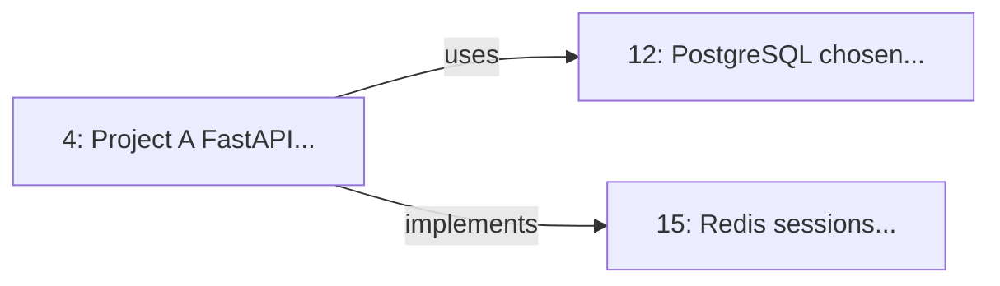

# Brain OS Complete User Guide & Tools Reference

**Your Cognitive Operating System - Instructions, Best Practices, and Technical Reference**

**Version:** Phase 3 Complete
**Last Updated:** 2026-01-09

---

## Table of Contents

1. [Quick Start](#quick-start)
2. [How Brain OS Works](#how-brain-os-works)
3. [Tool Reference](#tool-reference)
   - [Phase 2: Core Memory Tools](#phase-2-core-memory-tools)
   - [Phase 3: Advanced Memory Tools](#phase-3-advanced-memory-tools)
   - [Agent Tools](#agent-tools)
4. [Best Practices](#best-practices)
5. [Common Workflows](#common-workflows)
6. [Pro Tips](#pro-tips)
7. [Pitfalls to Avoid](#pitfalls-to-avoid)
8. [Quick Reference Cards](#quick-reference-cards)

---

## Quick Start

### The 3 Golden Rules

1. **Store everything important** - If you might forget it, store it
2. **Use instinctive memory for recurring context** - Things you need to remember automatically
3. **Let Brain OS synthesize** - Use `summarize_project` before starting work

### Your First 5 Minutes

```python
# 1. Store your current work context
create_memory(
    content="Working on FastTrack project building N8N orchestration workflows",
    sector="Procedural",
    memory_type="thinking",
    entities=["FastTrack", "N8N", "orchestration"],
    salience=0.7
)

# 2. Store important decisions (instinctive = auto-activates)
create_memory(
    content="Chose N8N over Zapier for self-hosting capability and cost control",
    sector="Semantic",
    memory_type="instinctive",  # Auto-surfaces when relevant
    entities=["N8N", "Zapier", "self-hosting"],
    observations=["€60/hour rate applies", "Client: Lazar"],
    salience=0.8
)

# 3. Get overview of everything
get_all_memories(limit=20)

# 4. Search when you need specifics
get_memory(query="FastTrack pricing")
```

---

## How Brain OS Works

### The Core Philosophy

Brain OS is a **cognitive operating system** - a symbiotic AI-human system where:
- **You** provide strategic direction ("The Brand")
- **Brain OS** handles "metabolic thinking" (memory, retrieval, synthesis)

### The Five-Sector Ontology

Your memories are organized across 5 cognitive sectors:

| Sector | Purpose | Example |
|--------|---------|---------|
| **Episodic** | Personal experiences, events | "Had meeting with client" |
| **Semantic** | Facts, decisions, knowledge | "FastAPI is async framework" |
| **Procedural** | Skills, how-to, workflows | "Deploy with Docker Compose" |
| **Emotional** | Feelings, reactions | "Frustrated by scope creep" |
| **Reflective** | Insights, learnings | "Learned to lock requirements early" |

### Memory Types

| Type | Behavior | When to Use |
|------|----------|-------------|
| `instinctive` | Auto-activates based on context | Core decisions, pricing, procedures |
| `thinking` | Explicit recall needed | Most memories (default) |
| `dormant` | Rarely activates | Archives, reference material |

### Salience Scoring

Importance from 0.0 to 1.0 that determines memory priority:
- **0.9-1.0**: Business-critical decisions
- **0.7-0.8**: Important project details
- **0.5-0.6**: Routine work information
- **0.3-0.4**: Nice-to-know details
- **0.0-0.2**: Temporary notes

---

## Tool Reference

### Phase 2: Core Memory Tools

#### TOOL 1: create_memory

**Purpose:** Store a new memory in the Synaptic Graph

**Input Parameters:**

| Parameter | Type | Required | Default | Description |
|-----------|------|----------|---------|-------------|
| `content` | string | Yes | - | The information to remember |
| `sector` | string | Yes | - | `Episodic`, `Semantic`, `Procedural`, `Emotional`, or `Reflective` |
| `source` | string | No | `"direct_chat"` | Origin: `transcript`, `meeting`, `technical_decision`, etc. |
| `salience` | float | No | `0.5` | Importance: 0.0 (low) to 1.0 (high) |
| `memory_type` | string | No | `"thinking"` | `instinctive`, `thinking`, or `dormant` |
| `activation_threshold` | float | No | Auto | Salience level for auto-activation |
| `entities` | list[string] | No | `[]` | Key entities: people, projects, technologies |
| `observations` | list[string] | No | `[]` | Additional context notes |

**How It Works:**
1. Validates input with Pydantic schemas
2. Auto-calculates `activation_threshold`:
   - `instinctive`: 0.25 (activates easily)
   - `thinking`: 0.65 (needs moderate salience)
   - `dormant`: 0.90 (rarely activates)
3. Stores in Neo4j with timestamps
4. Returns confirmation with memory ID

**Output:**
```
Memory stored successfully!
- ID: 4:a6501d47-1704-4066-b4c0-de0595f56a0f:14
- Sector: Semantic
- Created: 2026-01-09 16:19:01 UTC
- Salience: 0.8
- Content: Standard hourly rate set at €60/hour...
```

**Usage Examples:**

```python
# Storing a decision
create_memory(
    content="Chose PostgreSQL over MongoDB for ACID compliance",
    sector="Semantic",
    source="technical_decision",
    salience=0.8,
    memory_type="instinctive",  # Auto-surfaces when relevant
    entities=["Project A", "PostgreSQL", "MongoDB", "database"],
    observations=[
        "Financial data needs transactions",
        "Regulatory compliance required"
    ]
)

# Storing a meeting
create_memory(
    content="FastTrack client meeting: Discussed N8N workflow scope",
    sector="Episodic",
    source="meeting",
    salience=0.6,
    memory_type="thinking",
    entities=["FastTrack", "Lazar", "N8N", "scope"],
    observations=[
        "Budget: 20 hours approved",
        "Start: Monday Jan 12",
        "Rate: €60/hour agreed"
    ]
)

# Storing a procedure
create_memory(
    content="Deployment: Use docker compose up -d for production",
    sector="Procedural",
    memory_type="instinctive",  # Auto-surfaces when deploying
    entities=["deployment", "docker", "production"],
    observations=[
        "Must pull latest images first",
        "Check logs with docker logs"
    ],
    salience=0.7
)
```

---

#### TOOL 2: get_memory

**Purpose:** Quick keyword search for memories

**Input Parameters:**

| Parameter | Type | Required | Default | Description |
|-----------|------|----------|---------|-------------|
| `query` | string | Yes | - | Search term to find matching memories |
| `limit` | integer | No | `10` | Maximum results (1-200) |

**How It Works:**
1. Searches Neo4j for bubbles containing the query (case-insensitive)
2. Returns only active memories (`valid_to IS NULL`)
3. Orders by recency (newest first)
4. Updates `access_count` and `last_accessed`

**Output:**
```
Found 3 memories matching 'FastAPI':

1. ID: 4:d85ade1d... | Sector: Semantic | Salience: 0.80
   Created: 2026-01-09 15:47:32 UTC
   Source: technical_decision
   Content: Project A uses FastAPI for the backend API framework
```

**When to Use:**
- You know what you're looking for
- Need a specific fact or decision
- Quick fact-checking

**Examples:**
```python
# Find pricing information
get_memory(query="pricing rate", limit=5)

# Find deployment procedures
get_memory(query="deployment docker", limit=3)

# Find client history
get_memory(query="FastTrack Lazar", limit=10)
```

---

#### TOOL 3: get_all_memories

**Purpose:** Get complete overview with statistics

**Input Parameters:**

| Parameter | Type | Required | Default | Description |
|-----------|------|----------|---------|-------------|
| `limit` | integer | No | `50` | Maximum memories to return (1-200) |

**How It Works:**
1. Fetches all active bubbles ordered by recency
2. Groups by sector for statistics
3. Calculates percentage distribution
4. Generates ASCII bar chart

**Output:**
```
[STATS] Total Memories: 15

[SECTORS] Sector Distribution:

  Semantic     | ########## 5 (33.3%)

  Procedural   | ###### 5 (33.3%)

  Episodic     | #### 3 (20.0%)

  Reflective    | ## 2 (13.3%)

------------------------------------------------------------

Recent Memories:

1. [Episodic] Salience: 0.70
   Created: 2026-01-09 16:19
   Content: Standard hourly rate set at €60/hour...

2. [Semantic] Salience: 0.80
   Created: 2026-01-09 16:17
   Content: Chose N8N over Zapier...
```

**When to Use:**
- Starting work on a project (get context)
- Weekly reviews (see patterns)
- Feeling overwhelmed (ground yourself)
- Before planning sessions (inform decisions)

---

#### TOOL 4: list_sectors

**Purpose:** Understand cognitive state through sector distribution

**Input Parameters:** None

**How It Works:**
1. Queries Neo4j for memory count per sector
2. Returns formatted table with percentages
3. Shows cognitive balance/imbalance

**Output:**
```
Brain OS Cognitive Sectors:

+----------------+-------+------------+
| Sector         | Count | %          |
+----------------+-------+------------+
| Episodic       | 3     (20.0%)    |
| Semantic       | 5     (33.3%)    |
| Procedural     | 5     (33.3%)    |
| Emotional      | 1     (6.7%)     |
| Reflective     | 1     (6.7%)     |
+----------------+-------+------------+
```

**What It Tells You:**

**Balanced Distribution (Ideal):**
- Procedural: 20-30%
- Semantic: 25-35%
- Episodic: 15-25%
- Emotional: 5-15%
- Reflective: 5-15%

**Imbalance Indicators:**
- **Too much Procedural:** You're doing, not thinking
- **Too much Episodic:** You're experiencing, not learning
- **Too much Semantic:** You're planning, not executing
- **Too much Emotional:** You're feeling, not processing
- **Too much Reflective:** You're analyzing, not acting

---

#### TOOL 5: visualize_memories

**Purpose:** Visual representation of memory distribution

**Input Parameters:** None

**How It Works:**
1. Aggregates memory counts by sector
2. Generates ASCII-based visualization
3. Shows salience distribution
4. Displays temporal patterns

**Output:**
```
Brain OS Memory Visualization

[STATS] Total Memories: 15

[SECTORS] Sector Distribution:
  Semantic     | ########## 5 (33.3%)
  Procedural   | ###### 5 (33.3%)
  Episodic     | #### 3 (20.0%)
  Reflective    | ## 2 (13.3%)

[SALIENCE] Distribution:
  High (0.7-1.0)     | ###### 5 (33.3%)
  Medium (0.4-0.7)   | ########## 5 (33.3%)
  Low (0.0-0.4)      | ##### 5 (33.3%)
```

**When to Use:**
- Want to see salience distribution at a glance
- Checking temporal patterns (am I focused?)
- Quick overview before decision-making

---

### Phase 3: Advanced Memory Tools

#### TOOL 6: get_instinctive_memory

**Purpose:** Automatic memory activation based on context (The Oven Analogy)

**Input Parameters:**

| Parameter | Type | Required | Default | Description |
|-----------|------|----------|---------|-------------|
| `user_input` | string | Yes | - | Your message to analyze for automatic activation |

**How It Works (The Oven Analogy):**

Just like a hot oven reminds you of food when you walk near it, instinctive memories automatically surface based on context:

1. **Concept Extraction** (~100ms): Groq analyzes input for key concepts
2. **Memory Search**: Searches for `memory_type='instinctive'` bubbles
3. **Pattern Matching**: Matches concepts against entities, content, observations, sector
4. **Activation**: Returns memories where `activation_threshold < concept_salience`

**Speed:** ~100-500ms
**LLM Used:** Groq (fast classification)

**Output:**
```
**2 Instinctive Memories Activated**

Input: "I'm starting work on Project A again"

### Semantic
- Project A uses FastAPI for backend (Salience: 0.80)
- Project A chose PostgreSQL over MongoDB (Salience: 0.70)

### Procedural
- Project A deployment: Use docker compose (Salience: 0.60)
```

**When to Use:**
- Starting work on a project ("I'm working on Project A...")
- Switching contexts ("Now I'm on deployment...")
- Need to remember something but can't recall what
- Feeling like you're forgetting something important

**Best Practices:**

1. **Use instinctive memory sparingly** - Only for things that should auto-activate:
   - ✅ Technology stack choices
   - ✅ Pricing structures
   - ✅ Deployment procedures
   - ✅ Client preferences
   - ❌ One-time events
   - ❌ Temporary info
   - ❌ Low-importance details

2. **Set activation_threshold appropriately:**
   ```python
   # Auto-surfaces easily (oven at 350°F)
   memory_type="instinctive",
   activation_threshold=0.25

   # Needs moderate salience boost
   memory_type="instinctive",
   activation_threshold=0.5

   # Rarely activates (oven at 200°F)
   memory_type="instinctive",
   activation_threshold=0.7
   ```

3. **Include relevant entities:**
   ```python
   entities=["pricing", "hourly rate", "FastTrack"]
   ```

**Real-World Scenarios:**

| Input | What Activates |
|-------|---------------|
| "I'm deploying Project A" | Deployment procedures, stack choices |
| "Meeting with FastTrack" | Client history, pricing, preferences |
| "Building an API" | Framework choices, architecture decisions |
| "Database design needed" | Past database decisions, SQL vs NoSQL rationale |

**Example:**
```python
# Store once (instinctive)
create_memory(
    content="Standard rate: €60/hour for all freelance development",
    sector="Semantic",
    memory_type="instinctive",
    activation_threshold=0.3,
    entities=["pricing", "hourly rate", "€60"],
    salience=0.8
)

# Later, just start working
get_instinctive_memory("What should I charge for this new project?")
# → Automatically retrieves your pricing policy!
```

---

#### TOOL 7: get_memory_relations

**Purpose:** Deep contextual retrieval with 3-agent system

**Input Parameters:**

| Parameter | Type | Required | Default | Description |
|-----------|------|----------|---------|-------------|
| `query` | string | Yes | - | What you're looking for |
| `conversation_history` | list[string] | No | `[]` | Recent messages for context (last 5-10) |
| `time_scope` | string | No | `"auto"` | `"recent"` (30 days), `"all_time"`, or `"auto"` |
| `salience_filter` | string | No | `"auto"` | `"high"` (>0.6), `"any"`, or `"auto"` |

**How It Works (3-Agent System):**

**Agent 1: Pre-Query Context** (~100ms)
- Analyzes query and conversation history using Groq
- Extracts related concepts for expanded search
- Determines optimal time scope and salience filter
- Identifies user's primary intent

**Agent 2: Contextual Query**
- Builds dynamic Cypher based on context
- Searches Neo4j for memories matching query + concepts
- Applies smart filters (time, salience)
- Retrieves related memories and their connections

**Agent 3: Post-Query Synthesis** (~2-5s)
- Groups results by theme
- Identifies key insights with relevance explanations
- Extracts relationships between memories
- Generates comprehensive synthesis using OpenRouter

**Speed:** ~2-5 seconds
**LLM Used:** Groq (pre-query) + OpenRouter (synthesis)

**Output:**
```
# Deep Memory Retrieval: Why did I choose PostgreSQL?

**Found 3 memories**
**Context**: technology_decision

## Themes
### database selection (high relevance)
### deployment architecture (medium relevance)

## Key Insights
- **PostgreSQL chosen for ACID transaction support** *Critical for financial data*
- **Redis caching improves performance** *30-minute TTL balances freshness*

## Relationships
- FastAPI → PostgreSQL: uses
- PostgreSQL → MongoDB: chosen_over
- Project A → Redis: implements

## All Memories
1. [Semantic] PostgreSQL chosen for ACID compliance (salience: 0.80)
2. [Semantic] FastAPI backend framework (salience: 0.80)
3. [Procedural] Redis session caching (salience: 0.60)
```

**When to Use:**
- "Why did I choose X over Y?" (Decision rationale)
- "How do I deploy this?" (All related memories)
- "What are the key decisions?" (High-level overview)
- Complex queries needing synthesis

**Best Practices:**

1. **Provide conversation history:**
   ```python
   get_memory_relations(
       query="What database should I use?",
       conversation_history=[
           "Building real-time notification system",
           "Expected load: 1M messages/day",
           "Budget constrained"
       ]
   )
   ```

2. **Use appropriate filters:**
   ```python
   # Recent stuff only
   time_scope="recent"  # Last 30 days

   # High-importance only
   salience_filter="high"  # > 0.6 salience
   ```

3. **Review the synthesis:**
   - Themes: What clusters emerged
   - Key insights: Relevance explained
   - Relationships: How memories connect

**When NOT to Use:**
- Simple keyword search (use `get_memory`)
- Quick lookup (faster tools available)
- Recent memories only (use time filters elsewhere)

---

#### TOOL 8: visualize_relations

**Purpose:** Visualize connections between memories

**Input Parameters:**

| Parameter | Type | Required | Default | Description |
|-----------|------|----------|---------|-------------|
| `bubble_id` | string | Yes | - | Bubble ID (any format: "4" or "4:abc123...") |
| `depth` | integer | No | `2` | Hops to explore (1-4 recommended) |
| `format` | string | No | `"mermaid"` | `"mermaid"` for diagram, `"neo4j"` for browser query |

**How It Works:**
1. Accepts bubble ID in any format (auto-extracts numeric ID)
2. Finds the specified bubble in Neo4j
3. Retrieves all connected memories up to specified depth
4. Returns either Mermaid diagram or Neo4j Browser query

**Output (Mermaid):**


**Output (Neo4j):**
```
## Neo4j Browser Visualization

**Bubble ID**: 4
**Depth**: 2 hops

### Neo4j Browser Query

Copy this into Neo4j Browser (http://localhost:7474):

```cypher
MATCH path = (b:Bubble) -[*1..2] - (related:Bubble)
WHERE id(b) = 4
AND b.valid_to IS NULL
AND related.valid_to IS NULL
RETURN path
```
```

**When to Use:**
- Understanding knowledge clusters
- Exploring related memories
- Finding unexpected connections
- Interactive graph analysis (Neo4j format)

**Finding Bubble IDs:**
```python
# From get_all_memories output
memories = get_all_memories(limit=10)
# Look for: "ID: 4:abc123..."
# Use just the number: "4"
```

---

### Agent Tools

#### TOOL 9: summarize_project

**Purpose:** AI-powered project summaries using retrieved memories

**Input Parameters:**

| Parameter | Type | Required | Default | Description |
|-----------|------|----------|---------|-------------|
| `project` | string | Yes | - | Project name to search for and summarize |
| `limit` | integer | No | `20` | Maximum memories to include (1-100) |

**How It Works:**
1. Searches for memories containing the project name
2. Formats memories for PocketFlow processing
3. Runs PocketFlow with OpenRouter CREATIVE model
4. Generates structured summary with sections

**Speed:** ~3-10 seconds
**LLM Used:** OpenRouter CREATIVE model

**Output:**
```
# Project Summary: FastTrack

**Source:** 5 memories analyzed
**Flow:** summarize_project_flow (PocketFlow)

---

## Overview

FastTrack is a client project focused on building N8N orchestration workflows for business process automation.

## Key Decisions

1. **Chose N8N over Zapier**
   - Self-hosting capability required
   - Cost control over long term
   - Client preference for local solution

2. **Pricing Structure**
   - Hourly rate: €60/hour
   - Iterative approval workflow
   - No fixed-price due to unclear requirements

## Action Items

- [ ] Build initial N8N workflow prototype
- [ ] Set up testing environment
- [ ] Schedule client demo

## Notes

- Client: Lazar
- Start date: Monday Jan 12
- Budget: 20 hours approved
- Payment terms: Net 15
```

**When to Use:**
- Starting work on a project after a break
- Onboarding to an existing project
- Preparing status reports
- Understanding project patterns

**Best Practices:**

1. **Use consistent project names:**
   ```python
   # Good: Consistent across memories
   create_memory(entities=["FastTrack", "N8N"], ...)
   create_memory(entities=["FastTrack", "pricing"], ...)

   # Then summarize
   summarize_project(project="FastTrack")
   ```

2. **Adjust limit based on project size:**
   ```python
   # Small project
   summarize_project(project="FastTrack", limit=10)

   # Large project
   summarize_project(project="BrainOS", limit=50)
   ```

---

## Best Practices

### Memory Creation Patterns

#### Pattern 1: The Decision Template

```python
create_memory(
    content=f"Chose {OPTION_A} over {OPTION_B} for {REASON}",
    sector="Semantic",
    memory_type="instinctive",
    entities=[PROJECT, OPTION_A, OPTION_B],
    observations=[
        f"Rationale: {PRIMARY_REASON}",
        f"Trade-off: {WHAT_YOU_GAVE_UP}",
        f"Context: {SITUATION}"
    ],
    salience=0.8
)
```

#### Pattern 2: The Meeting Template

```python
create_memory(
    content=f"{CLIENT} meeting: {TOPIC_DISCUSSED}",
    sector="Episodic",
    source="meeting",
    memory_type="thinking",
    entities=[CLIENT, PROJECT, TOPIC],
    observations=[
        f"Date: {DATE}",
        f"Outcome: {RESULT}",
        f"Action items: {TODO_LIST}"
    ],
    salience=0.6
)
```

#### Pattern 3: The Procedure Template

```python
create_memory(
    content=f"How to {TASK}: {STEP_BY_STEP}",
    sector="Procedural",
    memory_type="instinctive",
    entities=[PROJECT, TECHNOLOGY],
    observations=[
        f"Prerequisites: {PREREQS}",
        f"Common issues: {GOTCHAS}",
        f"Time estimate: {HOURS}"
    ],
    salience=0.7
)
```

#### Pattern 4: The Learning Template

```python
create_memory(
    content=f"Insight: {WHAT_YOU_LEARNED}",
    sector="Reflective",
    memory_type="thinking",
    entities=[PROJECT, CONCEPT],
    observations=[
        f"How I learned: {EXPERIENCE}",
        f"Future application: {WHEN_TO_USE}",
        f"Related concept: {CONNECTION}"
    ],
    salience=0.7
)
```

### Salience Guidelines

| Level | Range | Use For | Example |
|-------|-------|---------|---------|
| **Critical** | 0.9-1.0 | Business-altering decisions | "Chose startup over enterprise" |
| **High** | 0.7-0.8 | Important details | "Client prefers iterative approval" |
| **Medium** | 0.5-0.6 | Routine work | "Team meeting on Tuesday" |
| **Low** | 0.3-0.4 | Nice-to-know | "Considering VS Code extension" |
| **Minimal** | 0.0-0.2 | Temporary | "Remember to call Jim back" |

### Sector Balance Strategy

**Aim for this distribution:**

- **Procedural:** 20-30% (how to do things)
- **Semantic:** 25-35% (what to know)
- **Episodic:** 15-25% (what happened)
- **Emotional:** 5-15% (how it felt)
- **Reflective:** 5-15% (what learned)

**Rebalance if needed:**

| Too Much | Add More | Reduce |
|----------|----------|--------|
| Procedural | Reflective | Doing |
| Episodic | Semantic | Experiencing |
| Semantic | Action | Planning |
| Emotional | Reflective | Feeling |
| Reflective | Action | Analyzing |

---

## Common Workflows

### Workflow 1: Starting a New Project

```python
# 1. Check existing context
get_all_memories(limit=20)

# 2. Search for relevant past work
get_memory(query="similar project", limit=10)

# 3. Check for instinctive memories
get_instinctive_memory("I'm starting work on [project type]")

# 4. Store project setup
create_memory(
    content=f"Starting {PROJECT_NAME}: {SCOPE}",
    sector="Episodic",
    salience=0.7
)

# 5. Store initial decisions as instinctive
create_memory(
    content=f"Tech stack: {TECHNOLOGIES}",
    sector="Semantic",
    memory_type="instinctive",
    entities=[PROJECT_NAME] + TECHNOLOGIES,
    salience=0.8
)
```

### Workflow 2: After a Client Meeting

```python
# 1. Store the meeting (Episodic)
create_memory(
    content=f"{CLIENT} meeting: {DISCUSSED_TOPICS}",
    sector="Episodic",
    source="meeting",
    entities=[CLIENT, PROJECT],
    observations=NOTES,
    salience=0.6
)

# 2. Store decisions (Semantic, instinctive)
for DECISION in DECISIONS_MADE:
    create_memory(
        content=f"{CLIENT} decision: {DECISION}",
        sector="Semantic",
        memory_type="instinctive",
        entities=[CLIENT] + DECISION_KEYWORDS,
        observations=[RATIONALE],
        salience=0.8
    )

# 3. Store action items (Procedural, instinctive)
create_memory(
    content=f"Next steps for {CLIENT}: {ACTION_ITEMS}",
    sector="Procedural",
    memory_type="instinctive",
    entities=[CLIENT, "next steps"],
    observations=[DEADLINES],
    salience=0.7
)

# 4. Store emotional context (Emotional)
if FEELINGS:
    create_memory(
        content=f"Feeling about {CLIENT}: {EMOTIONAL_STATE}",
        sector="Emotional",
        salience=0.4
    )
```

### Workflow 3: Weekly Review

```python
# 1. Get overview
get_all_memories(limit=50)

# 2. Check sector balance
list_sectors()

# 3. Visualize patterns
visualize_memories()

# 4. Synthesize learnings (Reflective)
create_memory(
    content=f"Week of {DATE} reflection: {KEY_INSIGHTS}",
    sector="Reflective",
    salience=0.6
)

# 5. Identify themes
get_memory_relations(
    query="What were the main themes this week?",
    time_scope="recent"
)
```

### Workflow 4: Making a Decision

```python
# 1. Check for past decisions
get_memory(query="similar decision", limit=10)

# 2. Deep retrieval for context
get_memory_relations(
    query=f"Should I {CHOICE_A} or {CHOICE_B}?",
    conversation_history=[
        f"Context: {SITUATION}",
        f"Constraints: {LIMITATIONS}"
    ]
)

# 3. Store the decision
create_memory(
    content=f"Decision: Chose {WINNER} over {ALTERNATIVES}",
    sector="Semantic",
    memory_type="instinctive",
    entities=[PROJECT, WINNER, ALTERNATIVES],
    observations=[
        f"Criteria: {EVALUATION_FACTORS}",
        f"Rationale: {PRIMARY_REASON}",
        f"Trade-offs: {WHAT_YOU_GAVE_UP}",
        f"Confidence: {CERTAINTY_LEVEL}"
    ],
    salience=0.8
)
```

### Workflow 5: Context Switching

```python
# Before switching contexts:

# 1. See what auto-activates
get_instinctive_memory(f"I'm switching to {NEW_PROJECT}")

# 2. Get project summary
summarize_project(project=NEW_PROJECT, limit=20)

# 3. Check recent work
get_memory(query=NEW_PROJECT, limit=10)

# Now you're fully loaded with context
```

---

## Pro Tips

### Tip 1: The "Why" Pattern

Always store **why**, not just **what**:

```python
# Weak
create_memory(content="Use PostgreSQL")

# Strong
create_memory(
    content="Chose PostgreSQL over MongoDB for ACID transaction support",
    observations=[
        "Why: Financial data requires atomic transactions",
        "Trade-off: Gave up schema flexibility for data integrity"
    ]
)
```

### Tip 2: Entity Consistency

Use consistent entity names across memories:

```python
# Good: Consistent
create_memory(entities=["FastTrack", "N8N", "pricing"], ...)
create_memory(entities=["FastTrack", "Lazar", "N8N"], ...)

# Bad: Inconsistent
create_memory(entities=["FastTrack", "n8n", "pricing"], ...)
create_memory(entities=["fast track", "Lazar", "N8N automation"], ...)
```

### Tip 3: Observations Over Content

Put nuanced details in observations, keep content focused:

```python
create_memory(
    content="FastTrack pricing: €60/hour, iterative approval",
    sector="Semantic",
    entities=["FastTrack", "pricing", "hourly rate"],
    observations=[
        "Why iterative: Unclear requirements in early stages",
        "Why not fixed-price: Scope creep risk",
        "Client preference: Lazar approves each milestone"
    ]
)
```

### Tip 4: Instinctive Memory Strategy

Only mark memories as instinctive if they should **automatically** surface:

**Good candidates:**
- Technology stack choices
- Pricing structures
- Deployment procedures
- Client preferences

**NOT instinctive:**
- One-time events
- Temporary information
- Meeting notes (use `thinking`)

### Tip 5: Salience Decay Strategy

Periodically review and adjust salience:

```python
# Monthly: Review high-salience memories
memories = get_all_memories(limit=50)
for memory in memories:
    if memory.salience > 0.8:
        # Still critical? Or can we decay to 0.6?
```

### Tip 6: Conversation History Power

Always provide conversation history to `get_memory_relations`:

```python
# Weak
get_memory_relations(query="Database choice?")

# Strong
get_memory_relations(
    query="What database should I use?",
    conversation_history=[
        "Building real-time notifications",
        "1M messages/day expected",
        "Budget constrained"
    ]
)
```

### Tip 7: Project Boundaries

Keep projects clearly separated:

```python
# Good: Clear boundaries
create_memory(entities=["FastTrack", "N8N"], ...)
create_memory(entities=["HPE", "automation"], ...)

# Then query by project
get_memory(query="FastTrack")
```

### Tip 8: Temporal Awareness

Note time-sensitive information:

```python
create_memory(
    content="Pricing offer: €60/hour valid through Q1 2026",
    observations=[
        "Expiration: March 31, 2026",
        "After: May increase based on demand"
    ]
)
```

### Tip 9: Emotional Intelligence

Store emotions, then process them:

```python
# In the moment
create_memory(
    content=f"Feeling {EMOTION} about {SITUATION}",
    sector="Emotional",
    salience=0.4
)

# Later: Process into insight
create_memory(
    content=f"Insight: {WHAT_EMOTION_TAUGHT}",
    sector="Reflective",
    observations=[
        f"Original feeling: {EMOTION}",
        f"Trigger: {SITUATION}",
        f"Learning: {TAKEAWAY}"
    ],
    salience=0.6
)
```

### Tip 10: The Review Cycle

Weekly, do a full review:

```python
def weekly_review():
    get_all_memories(limit=50)
    list_sectors()
    visualize_memories()
    get_memory_relations(query="What did I learn?", time_scope="recent")
    create_memory(content=f"Week of {date}: {insights}", sector="Reflective")
```

---

## Pitfalls to Avoid

### Pitfall 1: Over-Using Instinctive Memory

**Problem:** Too much instinctive memory = noisy auto-activation

**Solution:** Only mark truly auto-relevant memories as instinctive

### Pitfall 2: Inconsistent Entity Names

**Problem:** "FastTrack" vs "fast track" = disconnected memories

**Solution:** Use consistent casing and spelling

### Pitfall 3: Storing Everything High-Salience

**Problem:** Can't distinguish critical from routine

**Solution:** Use the full 0.0-1.0 range

### Pitfall 4: Ignoring Sector Balance

**Problem:** Cognitive imbalance

**Solution:** Regularly check `list_sectors()` and adjust

### Pitfall 5: Weak Content Descriptions

**Problem:** "Meeting" tells you nothing

**Solution:** Include what, why, outcome

### Pitfall 6: Forgetting Observations

**Problem:** Missing nuance and context

**Solution:** Always add observations for important memories

### Pitfall 7: Not Using get_memory_relations

**Problem:** Missing connections and themes

**Solution:** Use deep retrieval for complex queries

### Pitfall 8: Storing But Never Retrieving

**Problem:** Memory hoarding without value

**Solution:** Regular retrieval cycles

### Pitfall 9: Ignoring Temporal Patterns

**Problem:** Can't see evolution over time

**Solution:** Note time-sensitive info in observations

### Pitfall 10: No Emotional Processing

**Problem:** Emotions stay raw, don't become insights

**Solution:** Emotional → Reflective pipeline

---

## Quick Reference Cards

### When to Use Each Tool

| I want to... | Use this tool |
|--------------|---------------|
| Store information | `create_memory` |
| Find something specific | `get_memory` |
| See everything | `get_all_memories` |
| Check cognitive balance | `list_sectors` |
| See patterns visually | `visualize_memories` |
| Auto-activate context | `get_instinctive_memory` |
| Deep understanding | `get_memory_relations` |
| Explore connections | `visualize_relations` |
| Get project overview | `summarize_project` |

### Memory Type Decision Tree

```
Should this memory auto-activate?
├─ Yes → memory_type="instinctive"
│   └─ activation_threshold: 0.3 (easy) to 0.7 (hard)
└─ No → memory_type="thinking"
    └─ For archive → memory_type="dormant"
```

### Salience Quick Guide

```
0.9-1.0: Business-defining decisions
0.7-0.8: Important project details
0.5-0.6: Routine work information
0.3-0.4: Nice-to-know details
0.0-0.2: Temporary notes
```

### Sector Quick Guide

```
Episodic:  "I had a meeting..."
Semantic:   "The best practice is..."
Procedural: "Here's how to..."
Emotional:  "I feel that..."
Reflective: "I learned that..."
```

### Tool Performance

| Tool | Speed | Best For |
|------|-------|----------|
| create_memory | ~50ms | Storing information |
| get_memory | ~100ms | Quick lookup |
| get_all_memories | ~100ms | Overview |
| list_sectors | ~50ms | Cognitive balance |
| visualize_memories | ~100ms | Pattern recognition |
| get_instinctive_memory | ~100-500ms | Auto-activation |
| get_memory_relations | ~2-5s | Deep understanding |
| visualize_relations | ~200ms | Connection exploration |
| summarize_project | ~3-10s | Project synthesis |

---

## Conclusion

Brain OS is your cognitive operating system. Use it to:

**Offload Memory:** Store everything you might forget
**Enhance Recall:** Auto-activate context when needed
**Synthesize Knowledge:** Turn experience into wisdom
**Understand Patterns:** See connections and themes
**Make Better Decisions:** Learn from past choices

**The key to success:**
1. **Store consistently** - Make it a habit
2. **Retrieve regularly** - Use what you store
3. **Synthesize often** - Turn data into wisdom
4. **Balance your cognition** - All sectors matter
5. **Trust the system** - Let Brain OS be your external brain

---

**End of Brain OS Complete User Guide & Tools Reference**
