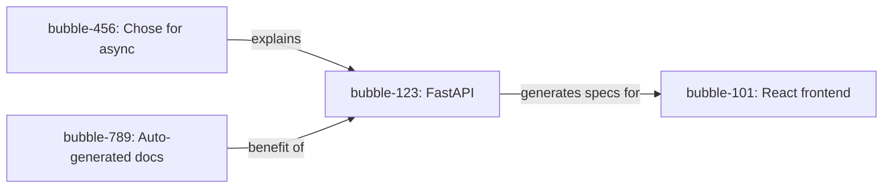

# Phase 3: API Changes

> **Breaking Changes**: Yes (Bubble schema changes, new memory types)
> **New Tools**: 3 (`get_instinctive_memory`, `get_memory_relations`, `visualize_relations`)
> **Modified Tools**: 1 (`create_memory` gains new parameters)
> **Deprecated**: None (but `src/agents/` folder replaced by `src/flows/`)

---

## New MCP Tools

### Tool 1: `get_instinctive_memory`

**Purpose**: Retrieve memories that automatically activate based on input (instinctive knowledge)

**Signature**:
```python
async def get_instinctive_memory(
    user_input: str,  # User's message to analyze for automatic memory activation
) -> str
```

**Example Usage**:
```python
# User says: "I'm starting work on Project A again"
result = await get_instinctive_memory(
    user_input="I'm starting work on Project A again"
)

# Returns:
"""
**3 Instinctive Memories Activated:**

- [Semantic] Project A uses FastAPI, React + TypeScript, PostgreSQL, Redis
- [Semantic] PostgreSQL chosen for ACID transaction compliance
- [Procedural] Redis handles session caching with 30-minute TTL
"""
```

**Implementation**:
```python
# src/tools/memory/instinctive_memory.py
from fastmcp import FastMCP
from pydantic import Field
from src.flows.instinctive_activation import instinctive_activation_flow

def register_instinctive_memory(mcp) -> None:
    @mcp.tool
    async def get_instinctive_memory(
        user_input: str = Field(
            description="User's message to analyze for automatic memory activation"
        ),
    ) -> str:
        """
        Retrieve memories that automatically activate based on input.

        Unlike get_memory (explicit search), this tool surfaces instinctive
        knowledge without conscious search—like knowing the oven is hot
        without thinking about it.

        This tool:
        1. Analyzes input for concept triggers (fast Groq classification)
        2. Finds memories with low activation_threshold matching concepts
        3. Returns instinctive memories organized by theme

        Use this when you want automatic knowledge activation, not explicit search.
        """
        from src.database.connection import get_driver

        shared = {
            "neo4j_driver": get_driver(),
            "user_input": user_input
        }

        await instinctive_activation_flow.run_async(shared)

        memories = shared.get("instinctive_memories", [])

        if not memories:
            return "No instinctive memories activated."

        # Group by theme
        themes = {}
        for memory in memories:
            theme = memory.get("theme", "general")
            if theme not in themes:
                themes[theme] = []
            themes[theme].append(memory)

        # Format output
        output = [f"**{len(memories)} Instinctive Memories Activated:**\n"]

        for theme, theme_memories in themes.items():
            output.append(f"\n### {theme.title()}\n")
            for mem in theme_memories:
                output.append(f"- [{mem['sector']}] {mem['content']}\n")

        return "\n".join(output)
```

**PocketFlow Implementation**:
```python
# src/flows/instinctive_activation.py
from pocketflow import AsyncNode, AsyncFlow
from src.utils.llm import get_groq_client

class AnalyzeInputNode(AsyncNode):
    """Quickly analyze user input for concept triggers."""

    async def prep_async(self, shared):
        return shared["user_input"]

    async def exec_async(self, user_input):
        import os
        import yaml

        groq = get_groq_client()
        prompt = f"""Extract key concepts from this message: "{user_input}"

Return YAML:
concepts:
  - name: concept_name
    salience: 0.0-1.0
"""

        response = await groq.chat.completions.create(
            model=os.getenv("GROQ_QUICK_MODEL"),
            messages=[{"role": "user", "content": prompt}],
            response_format={"type": "json_object"}
        )

        result = yaml.safe_load(response.choices[0].message.content)
        return result.get("concepts", [])

    async def post_async(self, shared, prep_res, concepts):
        shared["concepts"] = concepts
        return "default"

class FindInstinctiveMemoriesNode(AsyncNode):
    """Find memories that should auto-activate."""

    async def prep_async(self, shared):
        driver = shared["neo4j_driver"]
        concepts = shared["concepts"]
        return driver, concepts

    async def exec_async(self, inputs):
        from neo4j import AsyncGraphDatabase

        driver, concepts = inputs

        # Extract concept names and max salience
        concept_names = [c["name"] for c in concepts]
        max_salience = max([c.get("salience", 0.5) for c in concepts], default=0.5)

        query = """
            MATCH (b:Bubble)
            WHERE b.memory_type = 'instinctive'
            AND b.activation_threshold < $salience_threshold
            AND any(concept IN $concepts WHERE toLower(b.content) CONTAINS toLower(concept))
            RETURN b,
                   [l IN (b)-[:LINKED]->() | l.theme] as themes
            ORDER BY b.salience DESC
            LIMIT 10
        """

        async with driver.session() as session:
            result = await session.run(
                query,
                salience_threshold=max_salience + 0.2,
                concepts=concept_names
            )
            records = await result.data()

            # Add themes to each bubble
            bubbles = []
            for record in records:
                bubble = dict(record["b"])
                bubble["theme"] = record["themes"][0] if record["themes"] else "general"
                bubbles.append(bubble)

            return bubbles

    async def post_async(self, shared, prep_res, bubbles):
        shared["instinctive_memories"] = bubbles
        return "default"

# Wire the flow
analyze = AnalyzeInputNode()
find_instinctive = FindInstinctiveMemoriesNode()

analyze >> find_instinctive
instinctive_activation_flow = AsyncFlow(start=analyze)
```

---

### Tool 2: `get_memory_relations`

**Purpose**: Deep memory retrieval with contextual understanding (pre-query → DB → post-query)

**Signature**:
```python
async def get_memory_relations(
    query: str,                           # What you're looking for
    conversation_history: list[str] = [], # Recent messages for context
    time_scope: str = "auto",             # "recent" | "all_time" | "auto"
    salience_filter: str = "auto"         # "high" | "any" | "auto"
) -> str
```

**Example Usage**:
```python
# Context: We've been discussing deployment
history = [
    "How do I deploy Project A?",
    "Use Docker compose",
    "What about the database?",
    "For PostgreSQL..."
]

result = await get_memory_relations(
    query="What about caching?",
    conversation_history=history
)

# Returns:
"""
# Deep Memory Retrieval: What about caching?

**Found 4 memories**

## Themes

### Deployment Configuration (High relevance)
- Redis for session caching
- Docker compose includes Redis service
- Connection pooling configuration

### Infrastructure (Medium relevance)
- Cache invalidation strategy
- Redis persistence configuration

## Key Insights

- **Redis chosen for session caching**: 30-minute TTL with persistent storage
  *This matters because sessions need to survive container restarts*

- **Docker Compose setup**: Redis service linked to FastAPI backend
  *Provides complete deployment context*

## Relationships

- Redis session caching → Docker compose: deployed_with
- FastAPI backend → Redis: depends_on
- Cache invalidation → Session management: relates_to
"""
```

**Implementation**:
```python
# src/tools/memory/get_relations.py
from fastmcp import FastMCP
from pydantic import Field
from src.flows.contextual_retrieval import contextual_retrieval_flow

def register_get_memory_relations(mcp) -> None:
    @mcp.tool
    async def get_memory_relations(
        query: str = Field(
            description="What you're looking for (e.g., 'Project A technology decisions')"
        ),
        conversation_history: list[str] = Field(
            default=[],
            description="Recent messages for context (last 5-10 recommended)"
        ),
        time_scope: str = Field(
            default="auto",
            description="Time filter: 'recent' (30 days), 'all_time', or 'auto' (let AI decide)"
        ),
        salience_filter: str = Field(
            default="auto",
            description="Salience filter: 'high' (>0.6), 'any', or 'auto' (let AI decide)"
        ),
    ) -> str:
        """
        Deep memory retrieval with contextual understanding.

        This is different from get_memory:
        - **Pre-query**: Analyzes context and expands/narrows search intelligently
        - **Query**: Neo4j with smart filters based on conversation context
        - **Post-query**: Synthesizes results and finds relationships

        Use this when you need comprehensive, context-aware retrieval.
        Use get_memory for simple, direct searches.

        **Example contexts where this shines**:
        - "Why did I choose X over Y?" (finds decision + rationale)
        - "How do I deploy this?" (finds all deployment-related memories)
        - "What are the key decisions?" (finds high-salience memories)
        """
        from src.database.connection import get_driver

        shared = {
            "neo4j_driver": get_driver(),
            "user_input": query,
            "conversation_history": conversation_history,
            "time_scope": time_scope,
            "salience_filter": salience_filter
        }

        await contextual_retrieval_flow.run_async(shared)

        synthesis = shared.get("synthesis", {})

        if not synthesis or not synthesis.get("bubbles"):
            return f"No memories found for query: '{query}'"

        # Format output
        output = [
            f"# Deep Memory Retrieval: {query}\n",
            f"**Found {len(synthesis.get('bubbles', []))} memories**\n"
        ]

        if synthesis.get("themes"):
            output.append("\n## Themes\n")
            for theme in synthesis["themes"]:
                output.append(f"\n### {theme['name']} ({theme['relevance']} relevance)\n")

        if synthesis.get("highlights"):
            output.append("\n## Key Insights\n")
            for highlight in synthesis["highlights"]:
                output.append(f"\n- **{highlight['content']}**\n  *{highlight['relevance']}*\n")

        if synthesis.get("relationships"):
            output.append("\n## Relationships\n")
            for rel in synthesis["relationships"][:10]:  # Limit to 10
                output.append(f"- {rel['from']} → {rel['to']}: {rel['type']}\n")

        return "\n".join(output)
```

**PocketFlow Implementation** (from phase-overview.md):
```python
# src/flows/contextual_retrieval.py
from pocketflow import AsyncNode, AsyncFlow
import os
import yaml

class PreQueryContextNode(AsyncNode):
    """Analyze context before querying Neo4j."""

    async def prep_async(self, shared):
        return (
            shared["user_input"],
            shared.get("conversation_history", []),
            shared.get("time_scope", "auto"),
            shared.get("salience_filter", "auto")
        )

    async def exec_async(self, inputs):
        from src.utils.llm import get_groq_client

        user_input, history, time_scope, salience_filter = inputs

        groq = get_groq_client()
        prompt = f"""Analyze this conversation context:

User said: "{user_input}"

History: {history[-5:] if history else "None"}

Extract:
1. Primary intent (what are they looking for?)
2. Related concepts (to expand search)
3. Time scope (recent/all-time) {"[override: {time_scope}]" if time_scope != "auto" else ""}
4. Salience filter (high/any) {"[override: {salience_filter}]" if salience_filter != "auto" else ""}

Return YAML:
intent: primary_intent
related_concepts:
  - concept1
  - concept2
time_scope: recent | all_time
salience_filter: high | any
"""

        response = await groq.chat.completions.create(
            model=os.getenv("GROQ_QUICK_MODEL"),
            messages=[{"role": "user", "content": prompt}],
            response_format={"type": "json_object"}
        )

        return yaml.safe_load(response.choices[0].message.content)

    async def post_async(self, shared, prep_res, context):
        shared["query_context"] = context
        return "query"


class ContextualQueryNode(AsyncNode):
    """Query Neo4j with context-aware parameters."""

    async def prep_async(self, shared):
        driver = shared["neo4j_driver"]
        context = shared["query_context"]
        return driver, context

    async def exec_async(self, inputs):
        driver, context = inputs

        # Build dynamic Cypher based on context
        query = """
            MATCH (b:Bubble)
            WHERE 1=1
        """

        params = {}

        # Add concept filters
        if context.get("related_concepts"):
            or_conditions = " OR ".join([
                f"toLower(b.content) CONTAINS toLower('${{concept{i}}}')"
                for i in range(len(context["related_concepts"]))
            ])
            query += f" AND ({or_conditions})"
            for i, concept in enumerate(context["related_concepts"]):
                params[f"concept{i}"] = concept

        # Add time filter
        if context.get("time_scope") == "recent":
            query += " AND b.created_at > datetime() - duration('P30D')"

        # Add salience filter
        if context.get("salience_filter") == "high":
            query += " AND b.salience > 0.6"

        query += """
            RETURN b,
                   [r=(b)-[rel:LINKED]->(other) | {{
                       from: b.id,
                       to: other.id,
                       type: rel.type
                   }}] as relations
            ORDER BY b.salience DESC
            LIMIT 20
        """

        async with driver.session() as session:
            result = await session.run(query, **params)
            records = await result.data()

            bubbles = []
            all_relations = []

            for record in records:
                bubble = dict(record["b"])
                bubbles.append(bubble)
                all_relations.extend(record.get("relations", []))

            return {"bubbles": bubbles, "relations": all_relations}

    async def post_async(self, shared, prep_res, results):
        shared["query_results"] = results["bubbles"]
        shared["relations"] = results["relations"]
        return "synthesize"


class PostQuerySynthesizeNode(AsyncNode):
    """Synthesize and contextualize query results."""

    async def prep_async(self, shared):
        return (
            shared["query_results"],
            shared["query_context"],
            shared.get("relations", [])
        )

    async def exec_async(self, inputs):
        from src.utils.llm import get_openrouter_client

        bubbles, context, relations = inputs

        if not bubbles:
            return {"summary": "No memories found", "bubbles": [], "themes": [], "highlights": [], "relationships": []}

        # Format bubbles for LLM
        bubble_text = "\n".join([
            f"[{i}] {b['sector']}: {b['content'][:150]}..."
            for i, b in enumerate(bubbles[:15])
        ])

        # Format relations
        relation_text = "\n".join([
            f"- {r['from']} → {r['to']}: {r['type']}"
            for r in relations[:20]
        ]) if relations else "No relations found"

        openrouter = await get_openrouter_client()

        prompt = f"""Context: User is interested in "{context['intent']}"

Found {len(bubbles)} memories:

{bubble_text}

Relations:
{relation_text}

Synthesize these results:
1. Group by theme (max 4 themes)
2. Identify 2-3 most relevant highlights with explanations
3. List key relationships (max 10)

Return YAML:
themes:
  - name: theme_name
    relevance: high|medium|low
    bubble_indices: [0, 1, 2]
highlights:
  - content: summary
    relevance: why this matters
relationships:
  - from: bubble_id_or_content
    to: bubble_id_or_content
    type: relation_type
"""

        response = await openrouter.chat.completions.create(
            model=os.getenv("OPENROUTER_RESEARCHING_MODEL"),
            messages=[{"role": "user", "content": prompt}],
            response_format={"type": "json_object"}
        )

        synthesis = yaml.safe_load(response.choices[0].message.content)
        synthesis["bubbles"] = bubbles
        return synthesis

    async def post_async(self, shared, prep_res, synthesis):
        shared["synthesis"] = synthesis
        return "default"


# Wire the flow
pre_query = PreQueryContextNode()
query_db = ContextualQueryNode()
post_query = PostQuerySynthesizeNode()

pre_query - "query" >> query_db
query_db - "synthesize" >> post_query

contextual_retrieval_flow = AsyncFlow(start=pre_query)
```

---

### Tool 3: `visualize_relations`

**Purpose**: Visualize relationships between bubbles as Mermaid diagram

**Signature**:
```python
async def visualize_relations(
    bubble_id: str,  # Bubble ID to visualize
    depth: int = 2,  # How many hops to explore (1-4)
    format: str = "mermaid"  # "mermaid" or "neo4j"
) -> str
```

**Example Usage**:
```python
result = await visualize_relations(
    bubble_id="bubble-123",
    depth=2
)

# Returns:
"""
## Memory Relationships

**Bubble ID**: bubble-123
**Content**: "Project A uses FastAPI"
**Depth**: 2 hops
**Found**: 5 relationships

### Mermaid Diagram



### Neo4j Browser Query

Copy this into Neo4j Browser (http://localhost:7474):

```cypher
MATCH path = (b:Bubble {id: 'bubble-123'})-[*1..2]-(related)
RETURN path
```
"""
```

**Implementation**:
```python
# src/tools/memory/visualize_relations.py
from fastmcp import FastMCP
from pydantic import Field

def register_visualize_relations(mcp) -> None:
    @mcp.tool
    async def visualize_relations(
        bubble_id: str = Field(
            description="Bubble ID to visualize relationships for"
        ),
        depth: int = Field(
            default=2,
            description="How many hops to explore (1-4 recommended)",
            ge=1,
            le=4
        ),
        format: str = Field(
            default="mermaid",
            description="Output format: 'mermaid' for diagram, 'neo4j' for browser query"
        ),
    ) -> str:
        """
        Visualize relationships between bubbles.

        Returns either:
        - Mermaid diagram code for inline visualization
        - Neo4j Browser query for interactive exploration

        Relationships show how memories connect:
        - **explains**: Rationale or justification
        - **benefits**: Positive outcome or advantage
        - **contradicts**: Conflict or disagreement
        - **relates_to**: General association
        """
        from src.database.connection import get_driver

        driver = get_driver()

        query = """
            MATCH (b:Bubble {id: $bubble_id})
            MATCH path = (b)-[r:LINKED*1..{depth}]-(related:Bubble)
            RETURN b as center,
                   collect(DISTINCT {{
                       bubble: related,
                       relation: head([(b)-[r:LINKED]-(related) | r])[0]
                   }}) as connections
        """

        async with driver.session() as session:
            result = await session.run(query, bubble_id=bubble_id, depth=depth)
            record = await result.single()

            if not record:
                return f"## Error\n\nNo bubble found with ID: {bubble_id}"

            center = dict(record["center"])
            connections = record["connections"]

        if format == "neo4j":
            return f"""
## Neo4j Browser Visualization

**Bubble ID**: {bubble_id}
**Content**: {center['content'][:100]}...

### Neo4j Browser Query

Copy this into Neo4j Browser (http://localhost:7474):

```cypher
MATCH path = (b:Bubble {{id: '{bubble_id}'}})-[*1..{depth}]-(related:Bubble)
RETURN path
```

This will show an interactive graph with all connected memories.
"""

        # Mermaid format
        mermaid = "graph LR\n"
        mermaid += f'    B1["{bubble_id[:20]}: {center["content"][:30]}..."]\n'

        for i, conn in enumerate(connections[:20], 2):  # Limit to 20
            bubble = conn["bubble"]
            relation = conn["relation"]
            node_id = f"B{i}"
            mermaid += f'    {node_id}["{bubble["id"][:20]}: {bubble["content"][:30]}..."]\n'
            mermaid += f'    B1 -->|{relation.get("type", "relates")}| {node_id}\n'

        return f"""
## Memory Relationships

**Bubble ID**: {bubble_id}
**Content**: {center['content'][:100]}...
**Depth**: {depth} hops
**Found**: {len(connections)} relationships

### Mermaid Diagram

```mermaid
{mermaid}
```

### Neo4j Browser Query

For interactive exploration, copy this into Neo4j Browser:

```cypher
MATCH path = (b:Bubble {{id: '{bubble_id}'}})-[*1..{depth}]-(related:Bubble)
RETURN path
```
"""
```

---

## Modified Tools

### `create_memory` - Enhanced Parameters

**Current Signature (Phase 2)**:
```python
async def create_memory(
    content: str,
    sector: str,
    source: str = "direct_chat",
    salience: float = 0.5,
) -> str
```

**New Signature (Phase 3)**:
```python
async def create_memory(
    content: str,
    sector: str,
    source: str = "direct_chat",
    salience: float = 0.5,
    memory_type: str = "thinking",        # NEW
    activation_threshold: float = None,   # NEW (auto-calculated if None)
    entities: list[str] = [],             # NEW
    observations: list[str] = [],         # NEW
) -> str
```

**New Parameters**:

| Parameter | Type | Default | Description |
|-----------|------|---------|-------------|
| `memory_type` | str | `"thinking"` | `"instinctive"` \| `"thinking"` \| `"dormant"` |
| `activation_threshold` | float | `None` | 0.0-1.0, auto-calculated if None |
| `entities` | list[str] | `[]` | Named entities mentioned |
| `observations` | list[str] | `[]` | Specific facts/observations |

**Example Usage**:
```python
# Create an instinctive memory (high-priority decision)
await create_memory(
    content="Project A uses FastAPI for backend API framework",
    sector="Semantic",
    source="technical_decision",
    salience=0.8,
    memory_type="instinctive",
    activation_threshold=0.2,  # Auto-activate on relevant context
    entities=["Project A", "FastAPI", "API", "backend"],
    observations=[
        "Chosen over Flask for async support",
        "Automatic OpenAPI documentation",
        "Native Pydantic validation"
    ]
)

# Create a thinking memory (normal recall)
await create_memory(
    content="Discussed API design with team on Tuesday",
    sector="Episodic",
    source="meeting",
    salience=0.5,
    memory_type="thinking",
    # activation_threshold auto-calculated as 0.7
)
```

**Implementation Changes**:

```python
# src/tools/memory/create_memory.py (enhanced)
from fastmcp import FastMCP
from pydantic import Field

def register_create_memory(mcp) -> None:
    @mcp.tool
    async def create_memory(
        content: str = Field(description="The information to remember"),
        sector: str = Field(description="Cognitive sector: Episodic, Semantic, Procedural, Emotional, or Reflective"),
        source: str = Field(default="direct_chat", description="Origin of the data"),
        salience: float = Field(default=0.5, ge=0.0, le=1.0, description="Importance score from 0.0 to 1.0"),
        # NEW PARAMETERS
        memory_type: str = Field(
            default="thinking",
            description="Memory type: 'instinctive' (auto-activates), 'thinking' (explicit recall), or 'dormant' (low priority)"
        ),
        activation_threshold: float = Field(
            default=None,
            ge=0.0,
            le=1.0,
            description="Activation threshold (0.0-1.0). If None, auto-calculated based on memory_type"
        ),
        entities: list[str] = Field(
            default=[],
            description="Named entities mentioned (e.g., ['Project A', 'FastAPI'])"
        ),
        observations: list[str] = Field(
            default=[],
            description="Specific facts or observations (e.g., ['Chosen for async support'])"
        ),
    ) -> str:
        """
        Store a new memory in the Synaptic Graph.

        **Phase 3 Enhancements**:
        - **memory_type**: Classify as instinctive/thinking/dormant
        - **activation_threshold**: Control when memory auto-activates
        - **entities**: Track named entities for relationship discovery
        - **observations**: Store structured observations

        **Memory Types**:
        - **instinctive**: Automatically surfaces on relevant context (like muscle memory)
          - Use for: Frequently accessed knowledge, key decisions, important facts
          - activation_threshold: 0.2-0.3 (auto if not specified)

        - **thinking**: Requires explicit search or strong context match
          - Use for: General memories, meeting notes, observations
          - activation_threshold: 0.6-0.7 (auto if not specified)

        - **dormant**: Low priority, rarely surfaces
          - Use for: Archived information, outdated context
          - activation_threshold: 0.9+ (auto if not specified)

        **Example**:
        ```
        create_memory(
            content="Project A uses FastAPI",
            sector="Semantic",
            memory_type="instinctive",
            entities=["Project A", "FastAPI"],
            observations=["Async support", "Auto OpenAPI docs"]
        )
        ```
        """
        from src.database.connection import get_driver
        from datetime import datetime
        import uuid

        # Auto-calculate activation_threshold if not provided
        if activation_threshold is None:
            if memory_type == "instinctive":
                activation_threshold = 0.25
            elif memory_type == "thinking":
                activation_threshold = 0.65
            elif memory_type == "dormant":
                activation_threshold = 0.90
            else:
                activation_threshold = 0.5

        driver = get_driver()

        query = """
            CREATE (b:Bubble {
                id: randomUUID(),
                content: $content,
                sector: $sector,
                source: $source,
                salience: $salience,
                memory_type: $memory_type,
                activation_threshold: $activation_threshold,
                entities: $entities,
                observations: $observations,
                created_at: datetime(),
                updated_at: datetime(),
                valid_from: datetime(),
                valid_to: NULL
            })
            RETURN b.id as id, b.memory_type as memory_type, b.activation_threshold as threshold
        """

        async with driver.session() as session:
            result = await session.run(
                query,
                content=content,
                sector=sector,
                source=source,
                salience=salience,
                memory_type=memory_type,
                activation_threshold=activation_threshold,
                entities=entities,
                observations=observations
            )
            record = await result.single()

            bubble_id = record["id"]

        return f"""Memory stored successfully!

**Bubble ID**: {bubble_id}
**Content**: {content[:100]}{'...' if len(content) > 100 else ''}
**Sector**: {sector}
**Memory Type**: {memory_type}
**Activation Threshold**: {activation_threshold}
**Entities**: {', '.join(entities) if entities else 'None'}
**Observations**: {len(observations)} stored

You can retrieve this memory later with:
- `get_memory(query="{content[:30]}...")`
- `get_memory_relations(query="{content[:30]}...")` (with context)
- `get_instinctive_memory(user_input="...")` (if instinctive)
"""
```

---

## Neo4j Schema Changes

### Current Schema (Phase 2)

```cypher
CREATE (b:Bubble {
    id: "uuid",
    content: "text",
    sector: "Episodic|Semantic|Procedural|Emotional|Reflective",
    source: "direct_chat",
    salience: 0.5,
    created_at: datetime(),
    updated_at: datetime(),
    valid_from: datetime(),
    valid_to: datetime() NULL
})
```

### Enhanced Schema (Phase 3)

```cypher
CREATE (b:Bubble {
    // PHASE 2 FIELDS (unchanged)
    id: "uuid",
    content: "text",
    sector: "Episodic|Semantic|Procedural|Emotional|Reflective",
    source: "direct_chat",
    salience: 0.5,
    created_at: datetime(),
    updated_at: datetime(),
    valid_from: datetime(),
    valid_to: datetime() NULL,

    // PHASE 3 FIELDS (new)
    memory_type: "instinctive|thinking|dormant",
    activation_threshold: 0.25,
    entities: ["entity1", "entity2"],
    observations: ["observation1", "observation2"],
    access_count: 0,
    last_accessed: datetime() NULL
})

CREATE INDEX b_memory_type IF NOT EXISTS FOR (b:Bubble) ON (b.memory_type)
CREATE INDEX b_activation_threshold IF NOT EXISTS FOR (b:Bubble) ON (b.activation_threshold)
CREATE INDEX b_entities IF NOT EXISTS FOR (b:Bubble) ON (b.entities)

// New relationship type for bubble connections
CREATE (b1:Bubble)-[:LINKED {type: "explains", weight: 0.8}]->(b2:Bubble)
```

### Migration Script

```python
# src/database/migrations/phase3_migration.py
async def migrate_to_phase3(driver):
    """Add Phase 3 fields to existing bubbles."""

    query = """
        MATCH (b:Bubble)
        WHERE b.memory_type IS NULL
        SET b.memory_type = 'thinking',
            b.activation_threshold = CASE
                WHEN b.salience > 0.7 THEN 0.3
                WHEN b.salience > 0.4 THEN 0.6
                ELSE 0.8
            END,
            b.entities = [],
            b.observations = [],
            b.access_count = 0,
            b.last_accessed = NULL
        RETURN count(b) as migrated
    """

    async with driver.session() as session:
        result = await session.run(query)
        record = await result.single()
        return record["migrated"]
```

---

## MCP Tool Registration Updates

### `src/tools/memory/__init__.py` (Updated)

```python
"""
Memory tools module.
Contains all memory-related MCP tools organized by function.
"""

from src.tools.memory.create_memory import register_create_memory
from src.tools.memory.get_memory import register_get_memory
from src.tools.memory.list_sectors import register_list_sectors
from src.tools.memory.visualize_memories import register_visualize_memory

# PHASE 3 ADDITIONS
from src.tools.memory.instinctive_memory import register_instinctive_memory
from src.tools.memory.get_relations import register_get_memory_relations
from src.tools.memory.visualize_relations import register_visualize_relations


def register_memory_tools(mcp) -> None:
    """
    Register all memory tools with the given FastMCP instance.

    This is the main entry point for memory tool registration.
    Call this function to add all memory tools to your MCP server.

    Args:
        mcp: The FastMCP instance to register tools with.
    """
    # PHASE 2 TOOLS
    register_create_memory(mcp)
    register_get_memory(mcp)
    register_list_sectors(mcp)
    register_visualize_memory(mcp)

    # PHASE 3 TOOLS
    register_instinctive_memory(mcp)
    register_get_memory_relations(mcp)
    register_visualize_relations(mcp)


__all__ = ["register_memory_tools"]
```

---

## Performance Considerations

### Tool Latency Targets

| Tool | Target Latency | Optimization |
|------|----------------|--------------|
| `get_instinctive_memory` | <200ms | Groq fast model, cached queries |
| `get_memory_relations` | <3s | Parallel pre-query, indexed Neo4j |
| `visualize_relations` | <500ms | Pure Neo4j query, no LLM |
| `create_memory` | <100ms | Single write, no LLM |

### Caching Strategy

```python
# Cache instinctive activation results
from functools import lru_cache

@lru_cache(maxsize=100)
def cached_concept_analysis(user_input: str) -> list:
    """Cache concept extraction for identical inputs."""
    return extract_concepts(user_input)
```

---

## Backward Compatibility

### Breaking Changes

1. **Bubble schema**: Existing bubbles gain `memory_type="thinking"` (migration required)
2. **create_memory**: New optional parameters (backward compatible)
3. **src/agents/**: Replaced by `src/flows/` (requires code migration)

### Migration Checklist

- [ ] Run Neo4j migration script
- [ ] Update `create_memory` calls in existing code
- [ ] Migrate `BaseAgent` to `AsyncNode` patterns
- [ ] Update Claude Desktop config (if needed)

---

**End of API Changes**
