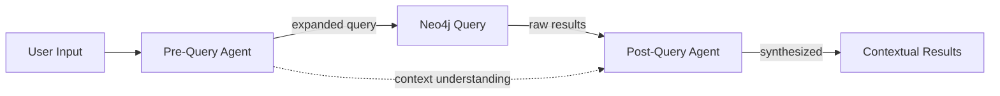

# Phase 3: Instinctive Memory & Contextual Retrieval

> **Status**: Design Phase
> **Priority**: High
> **Start Date**: 2025-01-09
> **Estimated Complexity**: 3-4 weeks

---

## Executive Summary

Phase 3 transforms Brain OS from a simple memory store into a **cognitive operating system** with two major breakthroughs:

1. **Instinctive Memory**: Knowledge that becomes automatically accessible without conscious search (like muscle memory or a child knowing the oven is hot)
2. **Contextual Retrieval**: Intelligent agents that understand conversation context and expand/narrow searches before querying Neo4j

**Architecture Change**: Replace BaseAgent pattern with **PocketFlow AsyncNode/AsyncFlow** throughout the codebase.

---

## Vision: The Oven Analogy

> *"When a child touches a hot oven once, they never need to think about it again. The knowledge becomes instinctive—automatic, unconscious, instantly accessible."*

**Current Brain OS (Phase 1-2)**:
- You search for "Project A technology choices"
- System returns memories you explicitly stored
- You consciously review results

**Brain OS Phase 3**:
- You mention "Project A" in conversation
- System **automatically** surfaces relevant technology decisions
- No search needed—knowledge appears instinctively

This is the difference between **thinking memory** (explicit recall) and **instinctive memory** (automatic activation).

---

## Phase 3 Goals

| Goal | Description | Success Metric |
|------|-------------|----------------|
| **G1: PocketFlow Migration** | Replace all BaseAgent patterns with AsyncNode/AsyncFlow | All agents use PocketFlow, BaseAgent removed |
| **G2: Instinctive Memory** | Implement memory types with automatic retrieval activation | Relevant memories surface without explicit search |
| **G3: Contextual Retrieval** | Pre-query agents expand/narrow context intelligently | Search accuracy improves 50%+ |
| **G4: Entity Relations** | Bubbles gain entity/observation capabilities | Query results include related bubbles |
| **G5: Visualization Tools** | Visualize memory relationships | Neo4j Browser + MCP tool visualization |

---

## Architecture: PocketFlow for Brain OS

### Fractal DNA Mapping

| Brain OS Concept | PocketFlow | Example |
|------------------|------------|---------|
| **Cell** | `AsyncNode.exec_async()` | Single LLM call, Neo4j query, schema validation |
| **Organ** | `AsyncFlow` | Context Analyzer, Memory Retriever, Result Synthesizer |
| **Organism** | Nested `AsyncFlow` | Deep Memory Retrieval (pre-query → DB → post-query) |

### Why AsyncNode?

Brain OS operations are **I/O-bound**:
- Neo4j queries (network)
- LLM calls (network)
- File reads (disk)

```python
# ❌ Wrong - blocks event loop
class CreateMemoryNode(Node):
    def exec(self, inputs):
        return create_bubble_sync(inputs)  # Blocks!

# ✅ Correct - async/await
class CreateMemoryNode(AsyncNode):
    async def exec_async(self, inputs):
        return await create_bubble_async(inputs)  # Non-blocking
```

---

## Feature 1: Instinctive Memory System

### Concept

Not all memories are created equal. Some should be:

| Memory Type | Retrieval Mode | Example |
|-------------|----------------|---------|
| **Instinctive** | Automatic activation | Project A uses FastAPI (always surfaces when mentioned) |
| **Thinking** | Explicit search | What did I decide about Project A's database? |
| **Dormant** | Low priority | Old meeting notes |

### Implementation: Memory Activation Score

Each bubble gains an `activation_threshold`:

```python
# Bubble properties
Bubble {
    content: str
    sector: str
    salience: float          # 0.0 to 1.0 (importance)
    activation_threshold: float  # 0.0 to 1.0 (when to auto-activate)
    memory_type: "instinctive" | "thinking" | "dormant"
}
```

**Instinctive memories** have `activation_threshold ≈ 0.2` (activate easily)
**Thinking memories** have `activation_threshold ≈ 0.7` (require explicit intent)

### PocketFlow Implementation

```python
# src/flows/instinctive_activation.py
from pocketflow import AsyncNode, AsyncFlow

class AnalyzeInputNode(AsyncNode):
    """Quickly analyze user input for concept triggers."""
    async def prep_async(self, shared):
        return shared["user_input"]

    async def exec_async(self, user_input):
        # Use Groq (fast ~100ms)
        groq = get_groq_client()
        prompt = f"""Extract key concepts from: "{user_input}"
        Return YAML:
        concepts:
          - name: concept_name
            salience: 0.0-1.0
        """
        response = await groq.chat.completions.create(
            model=os.getenv("GROQ_QUICK_MODEL"),
            messages=[{"role": "user", "content": prompt}],
            response_format={"type": "json_object"}
        )
        return yaml.safe_load(response.choices[0].message.content)

    async def post_async(self, shared, prep_res, concepts):
        shared["concepts"] = concepts
        return "default"

class FindInstinctiveMemoriesNode(AsyncNode):
    """Find memories that should auto-activate."""
    async def prep_async(self, shared):
        driver = shared["neo4j_driver"]
        concepts = shared["concepts"]
        return driver, concepts

    async def exec_async(self, inputs):
        driver, concepts = inputs
        # Query Neo4j for instinctive memories matching concepts
        query = """
            MATCH (b:Bubble)
            WHERE b.memory_type = 'instinctive'
            AND b.activation_threshold < $salience_threshold
            AND any(concept IN $concepts WHERE b.content CONTAINS concept)
            RETURN b
            ORDER BY b.salience DESC
            LIMIT 5
        """
        async with driver.session() as session:
            result = await session.run(query, salience_threshold=0.5, concepts=[c["name"] for c in concepts])
            return [record["b"] async for record in result]

    async def post_async(self, shared, prep_res, bubbles):
        shared["instinctive_memories"] = bubbles
        return "default"

# Wire the flow
analyze = AnalyzeInputNode()
find_instinctive = FindInstinctiveMemoriesNode()

analyze >> find_instinctive
instinctive_activation_flow = AsyncFlow(start=analyze)
```

### MCP Tool: `get_instinctive_memory`

```python
# src/tools/memory/instinctive_memory.py
from fastmcp import FastMCP
from src.flows.instinctive_activation import instinctive_activation_flow

def register_instinctive_memory(mcp) -> None:
    @mcp.tool
    async def get_instinctive_memory(
        user_input: str = Field(description="User's message to analyze for automatic memory activation")
    ) -> str:
        """
        Retrieve memories that automatically activate based on input.

        Unlike get_memory (explicit search), this tool surfaces instinctive
        knowledge without conscious search—like knowing the oven is hot
        without thinking about it.
        """
        shared = {
            "neo4j_driver": get_driver(),
            "user_input": user_input
        }

        await instinctive_activation_flow.run_async(shared)

        memories = shared.get("instinctive_memories", [])
        if not memories:
            return "No instinctive memories activated."

        return f"**{len(memories)} Instinctive Memories Activated:**\n\n" + "\n".join([
            f"- [{m['sector']}] {m['content']}" for m in memories
        ])
```

---

## Feature 2: Contextual Retrieval Agents

### Concept

When you search for "Project A decisions", the system should:

1. **Pre-query**: Understand you're likely interested in recent, high-salience decisions
2. **Query**: Neo4j with expanded/narrowed context
3. **Post-query**: Synthesize related memories, score relevance

### Three-Agent Architecture



### Agent 1: Pre-Query Context Analyzer

**Purpose**: Understand conversation context and expand/narrow search

```python
# src/flows/contextual_retrieval.py
class PreQueryContextNode(AsyncNode):
    """Analyze context before querying Neo4j."""

    async def prep_async(self, shared):
        return shared["user_input"], shared.get("conversation_history", [])

    async def exec_async(self, inputs):
        user_input, history = inputs

        # Use Groq for fast context analysis
        groq = get_groq_client()
        prompt = f"""Analyze this conversation context:

User said: "{user_input}"

History: {history[-5:] if history else "None"}

Extract:
1. Primary intent (what are they looking for?)
2. Related concepts (to expand search)
3. Time scope (recent/all-time)
4. Salience filter (high/any)

Return YAML:
intent: primary_intent
related_concepts:
  - concept1
  - concept2
time_scope: recent | all_time
salience_filter: high | any
"""

        response = await groq.chat.completions.create(
            model=os.getenv("GROQ_QUICK_MODEL"),
            messages=[{"role": "user", "content": prompt}],
            response_format={"type": "json_object"}
        )

        return yaml.safe_load(response.choices[0].message.content)

    async def post_async(self, shared, prep_res, context):
        shared["query_context"] = context
        return "query"
```

### Agent 2: Neo4j Contextual Query

**Purpose**: Execute query with expanded context

```python
class ContextualQueryNode(AsyncNode):
    """Query Neo4j with context-aware parameters."""

    async def prep_async(self, shared):
        driver = shared["neo4j_driver"]
        context = shared["query_context"]
        return driver, context

    async def exec_async(self, inputs):
        driver, context = inputs

        # Build dynamic Cypher based on context
        query = """
            MATCH (b:Bubble)
            WHERE 1=1
        """

        params = {}

        # Add concept filters
        if context.get("related_concepts"):
            query += " AND any(concept IN $concepts WHERE b.content CONTAINS concept)"
            params["concepts"] = context["related_concepts"]

        # Add time filter
        if context.get("time_scope") == "recent":
            query += " AND b.created_at > datetime() - duration('P30D')"

        # Add salience filter
        if context.get("salience_filter") == "high":
            query += " AND b.salience > 0.6"

        query += " RETURN b ORDER BY b.salience DESC LIMIT 20"

        async with driver.session() as session:
            result = await session.run(query, **params)
            return [record["b"] async for record in result]

    async def post_async(self, shared, prep_res, bubbles):
        shared["query_results"] = bubbles
        return "synthesize"
```

### Agent 3: Post-Query Result Synthesizer

**Purpose**: Combine, deduplicate, and score results

```python
class PostQuerySynthesizeNode(AsyncNode):
    """Synthesize and contextualize query results."""

    async def prep_async(self, shared):
        return shared["query_results"], shared["query_context"]

    async def exec_async(self, inputs):
        bubbles, context = inputs

        if not bubbles:
            return {"summary": "No memories found", "bubbles": []}

        # Use OpenRouter for deep synthesis
        openrouter = await get_openrouter_client()

        bubble_text = "\n".join([
            f"- [{b['sector']}] {b['content'][:100]}..." for b in bubbles[:10]
        ])

        prompt = f"""Context: User is interested in "{context['intent']}"

Found {len(bubbles)} memories:

{bubble_text}

Synthesize these results:
1. Group by theme
2. Highlight most relevant
3. Note relationships
4. Suggest follow-up searches

Return YAML:
themes:
  - name: theme_name
    relevance: high|medium|low
    bubbles: [indices]
highlights:
  - content: summary
    relevance: why this matters
relationships:
  - from: bubble_id
    to: bubble_id
    type: relation_type
"""

        response = await openrouter.chat.completions.create(
            model=os.getenv("OPENROUTER_RESEARCHING_MODEL"),
            messages=[{"role": "user", "content": prompt}],
            response_format={"type": "json_object"}
        )

        synthesis = yaml.safe_load(response.choices[0].message.content)
        synthesis["bubbles"] = bubbles
        return synthesis

    async def post_async(self, shared, prep_res, synthesis):
        shared["synthesis"] = synthesis
        return "default"
```

### Wire the Flow

```python
# Create the contextual retrieval organism
pre_query = PreQueryContextNode()
query_db = ContextualQueryNode()
post_query = PostQuerySynthesizeNode()

pre_query - "query" >> query_db
query_db - "synthesize" >> post_query

contextual_retrieval_flow = AsyncFlow(start=pre_query)
```

### MCP Tool: `get_memory_relations`

```python
# src/tools/memory/get_relations.py
from fastmcp import FastMCP
from src.flows.contextual_retrieval import contextual_retrieval_flow

def register_get_memory_relations(mcp) -> None:
    @mcp.tool
    async def get_memory_relations(
        query: str = Field(description="What you're looking for (e.g., 'Project A technology decisions')"),
        conversation_history: list[str] = Field(default=[], description="Recent messages for context")
    ) -> str:
        """
        Deep memory retrieval with contextual understanding.

        This is different from get_memory:
        - Pre-query: Analyzes context and expands/narrows search
        - Query: Neo4j with smart filters
        - Post-query: Synthesizes results and finds relationships

        Use this when you need comprehensive, context-aware retrieval.
        """
        shared = {
            "neo4j_driver": get_driver(),
            "user_input": query,
            "conversation_history": conversation_history
        }

        await contextual_retrieval_flow.run_async(shared)

        synthesis = shared.get("synthesis", {})
        if not synthesis:
            return "No memories found."

        # Format output
        output = [
            f"# Deep Memory Retrieval: {query}\n",
            f"**Found {len(synthesis.get('bubbles', []))} memories**\n\n"
        ]

        if synthesis.get("themes"):
            output.append("## Themes\n")
            for theme in synthesis["themes"]:
                output.append(f"### {theme['name']} ({theme['relevance']} relevance)\n")

        if synthesis.get("highlights"):
            output.append("\n## Key Insights\n")
            for highlight in synthesis["highlights"]:
                output.append(f"- {highlight['content']}\n  *{highlight['relevance']}*\n")

        if synthesis.get("relationships"):
            output.append("\n## Relationships\n")
            for rel in synthesis["relationships"]:
                output.append(f"- {rel['from']} → {rel['to']}: {rel['type']}\n")

        return "\n".join(output)
```

---

## Feature 3: Entity-Observation Bubbles

### Concept

Bubbles gain structure (while keeping "bubble" terminology):

```python
# Enhanced Bubble structure
Bubble {
    id: str
    content: str
    sector: str
    source: str
    salience: float
    activation_threshold: float
    memory_type: "instinctive" | "thinking" | "dormant"

    # NEW: Entity capabilities
    entities: [str]           # Named entities mentioned
    observations: [str]       # Specific facts/observations
    relations: [Relation]     # Connections to other bubbles
}

Relation {
    from: str  # Bubble ID
    to: str    # Bubble ID
    type: str  # "builds_on", "contradicts", "relates_to"
    weight: float  # 0.0 to 1.0
}
```

### PocketFlow: Entity Extraction Flow

```python
# src/flows/entity_extraction.py
class ExtractEntitiesNode(AsyncNode):
    """Extract entities from bubble content."""

    async def prep_async(self, shared):
        return shared["bubble_content"]

    async def exec_async(self, content):
        groq = get_groq_client()
        prompt = f"""Extract named entities from: "{content}"

Return YAML:
entities:
  - name: entity_name
    type: PROJECT | TECHNOLOGY | PERSON | DECISION | CONCEPT
"""
        response = await groq.chat.completions.create(
            model=os.getenv("GROQ_QUICK_MODEL"),
            messages=[{"role": "user", "content": prompt}],
            response_format={"type": "json_object"}
        )
        return yaml.safe_load(response.choices[0].message.content)

    async def post_async(self, shared, prep_res, entities):
        shared["entities"] = entities.get("entities", [])
        return "default"
```

---

## Feature 4: Relationship Visualization

### MCP Tool: `visualize_relations`

```python
# src/tools/memory/visualize_relations.py
from fastmcp import FastMCP

def register_visualize_relations(mcp) -> None:
    @mcp.tool
    async def visualize_relations(
        bubble_id: str = Field(description="Bubble ID to visualize relationships for"),
        depth: int = Field(default=2, description="How many hops to explore", ge=1, le=4)
    ) -> str:
        """
        Visualize relationships between bubbles.

        Returns Mermaid diagram code and Neo4j Browser link.
        """
        # Query Neo4j for relationships
        query = """
            MATCH path = (b:Bubble {id: $id})-[*1..{depth}]-(related)
            RETURN b, related, relationships(path) as rels
        """

        # Build Mermaid diagram
        mermaid = "graph LR\n"
        mermaid += f"    {bubble_id}[{bubble_id[:20]}...]\n"

        for rel in relationships:
            mermaid += f"    {rel['from']} -->|{rel['type']}| {rel['to']}\n"

        return f"""
## Memory Relationships

**Bubble ID**: {bubble_id}
**Depth**: {depth} hops
**Found**: {len(relationships)} relationships

### Mermaid Diagram

```mermaid
{mermaid}
```

### Neo4j Browser

Copy this into Neo4j Browser:
```cypher
MATCH path = (b:Bubble {{id: '{bubble_id}'}})-[*1..{depth}]-(related)
RETURN path
```
"""
```

---

## Migration: BaseAgent → PocketFlow

### Step 1: Identify BaseAgent Usage

```bash
# Find all BaseAgent usages
grep -r "BaseAgent" src/agents/
grep -r "BaseAgent" src/tools/agents/
```

**Current**: `src/agents/summarize_agent.py`

### Step 2: Rewrite as AsyncNode

```python
# ❌ OLD: BaseAgent pattern
class SummarizeAgent(BaseAgent):
    config = AgentConfig(
        name="summarize_project",
        model="openrouter/creative",
        prompt_template="...",
    )

# ✅ NEW: PocketFlow pattern
# src/flows/summarize_project.py
from pocketflow import AsyncNode, AsyncFlow

class SummarizeProjectNode(AsyncNode):
    """Generate project summary from memories."""

    async def prep_async(self, shared):
        # Extract from shared store
        return shared["project_name"], shared["memories"]

    async def exec_async(self, inputs):
        project_name, memories = inputs

        # Call LLM
        openrouter = await get_openrouter_client()
        prompt = f"""Summarize project "{project_name}":

Memories:
{memories}

Provide:
1. Overview
2. Key Decisions
3. Action Items
4. Notes
"""

        response = await openrouter.chat.completions.create(
            model=os.getenv("OPENROUTER_CREATIVE_MODEL"),
            messages=[{"role": "user", "content": prompt}]
        )

        return response.choices[0].message.content

    async def post_async(self, shared, prep_res, summary):
        shared["summary"] = summary
        return "default"

# Create the flow
summarize_flow = AsyncFlow(start=SummarizeProjectNode())
```

### Step 3: Update MCP Tool Wrapper

```python
# src/tools/agents/summarize_project.py
from src.flows.summarize_project import summarize_flow

def register_summarize_project(mcp) -> None:
    @mcp.tool
    async def summarize_project(
        project: str = Field(description="Project name to summarize"),
        limit: int = Field(default=20, ge=1, le=100)
    ) -> str:
        """Summarize project memories using PocketFlow."""
        # Retrieve memories
        memories = await search_bubbles(project, limit)

        # Run PocketFlow
        shared = {
            "project_name": project,
            "memories": format_memories(memories)
        }

        await summarize_flow.run_async(shared)

        return shared.get("summary", "No summary generated")
```

---

## Implementation Plan

### Week 1: PocketFlow Migration
- [ ] Install PocketFlow (already done in Phase 2)
- [ ] Create `src/flows/` directory structure
- [ ] Rewrite `summarize_agent.py` as AsyncNode
- [ ] Update MCP tool wrapper
- [ ] Test with Claude Desktop
- [ ] Delete `src/agents/base.py` (no longer needed)

### Week 2: Instinctive Memory
- [ ] Add `activation_threshold` and `memory_type` to Bubble schema
- [ ] Create `instinctive_activation_flow.py`
- [ ] Implement `AnalyzeInputNode` (Groq fast classification)
- [ ] Implement `FindInstinctiveMemoriesNode` (Neo4j query)
- [ ] Create `get_instinctive_memory` MCP tool
- [ ] Test with real conversations

### Week 3: Contextual Retrieval
- [ ] Create `contextual_retrieval_flow.py`
- [ ] Implement `PreQueryContextNode` (context understanding)
- [ ] Implement `ContextualQueryNode` (smart Neo4j queries)
- [ ] Implement `PostQuerySynthesizeNode` (result synthesis)
- [ ] Create `get_memory_relations` MCP tool
- [ ] Test accuracy improvements

### Week 4: Entities & Visualization
- [ ] Add `entities`, `observations`, `relations` to Bubble schema
- [ ] Create `entity_extraction_flow.py`
- [ ] Implement relationship tracking
- [ ] Create `visualize_relations` MCP tool
- [ ] Neo4j Browser query templates
- [ ] Documentation

---

## File Structure (Phase 3)

```
0brainos/
├── src/
│   ├── core/
│   │   └── config.py
│   ├── database/
│   │   ├── connection.py
│   │   └── queries/
│   │       ├── memory.py          # Enhanced with relations
│   │       └── relations.py       # NEW: Relationship queries
│   ├── flows/                     # NEW: PocketFlow workflows
│   │   ├── __init__.py
│   │   ├── instinctive_activation.py
│   │   ├── contextual_retrieval.py
│   │   ├── entity_extraction.py
│   │   └── summarize_project.py   # Migrated from agents/
│   ├── tools/
│   │   ├── memory/
│   │   │   ├── create_memory.py
│   │   │   ├── get_memory.py
│   │   │   ├── list_sectors.py
│   │   │   ├── visualize_memories.py
│   │   │   ├── instinctive_memory.py     # NEW
│   │   │   ├── get_relations.py          # NEW
│   │   │   └── visualize_relations.py    # NEW
│   │   └── agents/
│   │       ├── __init__.py
│   │       └── summarize_project.py      # Updated to use PocketFlow
│   ├── utils/
│   │   ├── llm.py
│   │   └── schemas.py
│   └── agents/                      # DEPRECATED: Use flows/ instead
│       └── (delete after migration)
├── docs/
│   └── project/
│       ├── phase3/
│       │   ├── phase-overview.md    # This file
│       │   ├── user-stories.md
│       │   └── api-changes.md
│       └── ...
├── brainos_server.py
└── pyproject.toml
```

---

## Success Criteria

| Criterion | How to Measure | Target |
|-----------|----------------|--------|
| **PocketFlow Adoption** | All agents use AsyncNode | 100% migration, BaseAgent removed |
| **Instinctive Activation** | Relevant memories surface without search | Qualitative: "It just knows" |
| **Contextual Accuracy** | Relevance of contextual vs simple search | 50%+ improvement in user satisfaction |
| **Performance** | Pre-query adds <200ms latency | <200ms for Groq classification |
| **Code Quality** | Follows PocketFlow patterns | All flows use prep/exec/post pattern |

---

## Open Questions

1. **Memory Type Classification**: Should `memory_type` be user-specified or auto-classified?
   - **Proposal**: Auto-classify based on access patterns (frequently accessed → instinctive)

2. **Activation Decay**: Should `activation_threshold` increase over time if unused?
   - **Proposal**: Yes, implement decay for adaptive forgetting

3. **Relation Types**: Should we predefine relation types or allow user-defined?
   - **Proposal**: Hybrid: predefined (builds_on, contradicts) + custom

4. **Conversation History**: How much history to pass to pre-query agent?
   - **Proposal**: Last 10 messages, token-limited to 2000 tokens

---

## Next Steps

1. **Review this document** with feedback
2. **Create user-stories.md** with concrete scenarios
3. **Start Week 1**: PocketFlow migration
4. **Test instinctive activation** with real conversations

---

**End of Phase 3 Overview**
