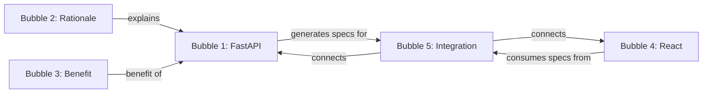

# Phase 3: User Stories

> **Purpose**: Concrete scenarios that Phase 3 features should enable

---

## User Story 1: Instinctive Technology Decisions

### The Scenario

**Week 1**: I'm working on Project A, a full-stack application. I store multiple memories:
- "Project A uses FastAPI for the backend API framework"
- "Project A uses React with TypeScript for the frontend"
- "Project A uses PostgreSQL as the database because I need ACID compliance for transactions"
- "Project A uses Redis for caching user sessions"

**Week 4**: I start a conversation with Claude:
> **User**: "I'm starting work on Project A again. What should I know?"

**Without Phase 3**: Claude calls `get_memory("Project A")` and returns all 4 memories. I have to read through them.

**With Phase 3**: The `get_instinctive_memory` tool is automatically triggered. It surfaces:
> **Instinctive Memories Activated** (3 memories):
> - Project A uses FastAPI, React + TypeScript, PostgreSQL, Redis
> - PostgreSQL chosen for ACID compliance
> - Redis handles session caching

### Acceptance Criteria

- [ ] When user mentions "Project A", instinctive memories activate automatically
- [ ] Technology decisions surface without explicit search
- [ ] Activation happens <200ms after user input
- [ ] Memories are grouped by theme (technology, rationale, infrastructure)

### Technical Implementation

```cypher
// Neo4j query for instinctive activation
MATCH (b:Bubble)
WHERE b.memory_type = 'instinctive'
AND b.activation_threshold < 0.3
AND any(keyword IN ['Project A', 'FastAPI', 'PostgreSQL', 'React'] WHERE b.content CONTAINS keyword)
RETURN b
ORDER BY b.salience DESC
LIMIT 5
```

---

## User Story 2: Contextual Decision Retrieval

### The Scenario

**Week 1**: I make a series of technology choices for Project A:
- "Chose FastAPI over Flask because of built-in async support and automatic OpenAPI docs"
- "Chose PostgreSQL over MongoDB because I need complex joins and transactions"
- "Chose Redis over Memcached because I wanted persistent caching options"

**Week 5**: I ask:
> **User**: "Why did I choose PostgreSQL for Project A instead of MongoDB?"

**Without Phase 3**: `get_memory("PostgreSQL")` returns the memory, but I miss the context of the comparison.

**With Phase 3**: `get_memory_relations` tool runs:

**Pre-query agent** analyzes:
- Intent: Understanding technology choice rationale
- Related concepts: MongoDB, database, comparison, alternatives
- Time scope: All-time (no filter)
- Salience filter: High (this was a key decision)

**Query** returns:
- Bubble 1: "Chose PostgreSQL over MongoDB because of complex joins and transactions"
- Bubble 2: "Project A needs ACID compliance for financial transactions"

**Post-query agent** synthesizes:
> **Theme**: Database Technology Choice (High relevance)
> - Chose PostgreSQL over MongoDB
> - Primary reasons: complex joins, ACID transactions
> - Context: Financial transaction requirements
>
> **Related Memories**:
> - → Project A needs ACID compliance (supports decision)

### Acceptance Criteria

- [ ] Pre-query agent identifies comparison intent ("PostgreSQL vs MongoDB")
- [ ] Query finds related decision AND supporting memories
- [ ] Post-query agent connects decision to rationale
- [ ] Synthesis explains "why", not just "what"

---

## User Story 3: Conversation Context Expansion

### The Scenario

**Conversation History**:
1. User: "How do I deploy Project A?"
2. Claude: "You can use Docker..."
3. User: "What about the database?"
4. Claude: "For PostgreSQL, you need to..."
5. User: "And Redis?"

**Current input**: "What about caching?"

**Without Phase 3**: Each query is independent. System doesn't understand we're discussing deployment.

**With Phase 3**: Pre-query agent analyzes conversation history:

```yaml
intent: deployment_configuration
related_concepts:
  - Docker
  - PostgreSQL
  - Redis
  - caching
  - deployment_stack
time_scope: recent  # We're in active discussion
salience_filter: high  # Active configuration work
```

**Query expands** to find:
- Redis configuration memories
- Docker compose setups
- Deployment architecture
- Caching strategies

**Synthesis** returns:
> **Deployment Configuration Theme** (High relevance)
>
> **Caching**:
> - Redis for session caching (from memory)
> - Docker compose includes Redis service
>
> **Related Deployment Memories**:
> - PostgreSQL container configuration
> - FastAPI container with uvicorn
> - Docker network setup

### Acceptance Criteria

- [ ] Conversation history context is understood
- [ ] Query expands beyond literal "caching" to deployment context
- [ ] Results are grouped by theme (deployment configuration)
- [ ] Related concepts (Docker, PostgreSQL) are included

---

## User Story 4: Relationship Visualization

### The Scenario

I've stored many interconnected memories about Project A:

```
Bubble 1: "Project A uses FastAPI"
Bubble 2: "FastAPI chosen over Flask for async support"
Bubble 3: "FastAPI automatic OpenAPI docs save documentation time"
Bubble 4: "Project A frontend uses React"
Bubble 5: "Frontend consumes FastAPI auto-generated OpenAPI specs"
```

I want to **see the relationships**:
- Bubble 2 explains Bubble 1 (rationale)
- Bubble 3 describes benefit of Bubble 1
- Bubble 5 connects Bubble 1 and Bubble 4

**Tool call**: `visualize_relations(bubble_id="Bubble 1", depth=2)`

**Returns**:



**Neo4j Browser Link**:
```cypher
MATCH path = (b:Bubble {id: 'Bubble 1'})-[*1..2]-(related)
RETURN path
```

### Acceptance Criteria

- [ ] Visualize relationships as Mermaid diagram
- [ ] Provide Neo4j Browser query for interactive exploration
- [ ] Support depth parameter (1-4 hops)
- [ ] Show relation types (explains, benefits, connects, contradicts)

---

## User Story 5: Adaptive Memory Classification

### The Scenario

**Initial storage**:
> "Project A uses FastAPI"

I create this memory with default settings:
- `salience: 0.5`
- `memory_type: "thinking"`  (default)
- `activation_threshold: 0.7`  (default)

**Access pattern over 4 weeks**:
- Week 1: Accessed 3 times (discussing backend)
- Week 2: Accessed 5 times (deciding frontend)
- Week 3: Accessed 8 times (API documentation)
- Week 4: Accessed 12 times (deployment configuration)

**System auto-upgrades**:
```python
# Adaptive classification based on access frequency
if access_count > 10 and recency_days < 30:
    memory_type = "instinctive"
    activation_threshold = 0.3  # Easier to activate
```

**Week 5**: I mention "Project A" in conversation
- **Instinctive activation**: "Project A uses FastAPI" appears automatically
- **No search needed**: Knowledge has become instinctive

### Acceptance Criteria

- [ ] Track access frequency and recency for each bubble
- [ ] Auto-upgrade frequently accessed memories to "instinctive"
- [ ] Auto-downgrade unused memories to "dormant"
- [ ] Update `activation_threshold` based on access patterns

---

## User Story 6: Conflict Detection

### The Scenario

**Week 1 memory**:
> "Project A will use PostgreSQL because I need ACID transactions"

**Week 3 memory** (changed my mind):
> "Project A will use MongoDB instead for flexibility with evolving schema"

**Week 5**: I ask about Project A database

**Without Phase 3**: Both memories return, but I don't notice the contradiction.

**With Phase 3**: Post-query agent detects conflict:

> **⚠️ Contradiction Detected**
>
> **Memory A** (Week 1): "Project A will use PostgreSQL for ACID transactions"
> **Memory B** (Week 3): "Project A will use MongoDB for schema flexibility"
>
> **Relation**: contradicts
>
> **Recommendation**: You may want to:
> 1. Mark one as invalid (use `valid_to` timestamp)
> 2. Create a new memory explaining the change
> 3. Clarify the decision evolution

### Acceptance Criteria

- [ ] Detect contradictory memories (same topic, different answers)
- [ ] Flag contradictions in synthesis results
- [ ] Suggest resolution actions (invalidate, explain, merge)
- [ ] Track contradiction relations in Neo4j

---

## User Story 7: Temporal Evolution

### The Scenario

My understanding of Project A evolves:

**Jan 1**: "Project A is a simple CRUD app"
**Jan 15**: "Project A now includes real-time notifications"
**Feb 1**: "Project A requires multi-tenant architecture"
**Feb 15**: "Project A needs workflow orchestration"

When I ask "What is Project A?", I want to see the **evolution**, not just latest state.

**Tool call**: `get_memory_relations(query="Project A scope evolution", include_temporal=True)`

**Returns**:

```yaml
timeline:
  - date: "2025-01-01"
    memory: "Simple CRUD app"
    status: superseded
  - date: "2025-01-15"
    memory: "Added real-time notifications"
    status: superseded
    relation: extends
  - date: "2025-02-01"
    memory: "Multi-tenant architecture required"
    status: superseded
    relation: extends
  - date: "2025-02-15"
    memory: "Workflow orchestration needed"
    status: current

evolution_chain:
  - from: "Simple CRUD app"
    to: "Real-time notifications"
    type: extends
  - from: "Real-time notifications"
    to: "Multi-tenant architecture"
    type: extends
  - from: "Multi-tenant architecture"
    to: "Workflow orchestration"
    type: extends
```

### Acceptance Criteria

- [ ] Track `valid_from` and `valid_to` timestamps
- [ ] Build evolution chains from temporal relations
- [ ] Show timeline of understanding progression
- [ ] Distinguish current vs superseded memories

---

## Prioritization

| User Story | Priority | Complexity | Dependencies |
|------------|----------|------------|--------------|
| US1: Instinctive Activation | P0 (Must-have) | Medium | Instinctive memory system |
| US2: Contextual Retrieval | P0 (Must-have) | High | Pre/post-query agents |
| US3: Conversation Context | P1 (Should-have) | Medium | Context expansion |
| US4: Relationship Viz | P1 (Should-have) | Low | Relation tracking |
| US5: Adaptive Classification | P2 (Nice-to-have) | Medium | Access tracking |
| US6: Conflict Detection | P2 (Nice-to-have) | High | Relation analysis |
| US7: Temporal Evolution | P2 (Nice-to-have) | High | Temporal tracking |

**Phase 3 MVP**: Focus on US1, US2, US4

**Phase 3+**: US3, US5, US6, US7

---

## Testing Scenarios

### Scenario 1: End-to-End Instinctive Activation

1. Store 10 memories about Project X
2. Mark 3 as "instinctive" (frequently accessed)
3. Start new conversation mentioning "Project X"
4. Verify instinctive memories surface automatically
5. Verify latency <200ms

### Scenario 2: Contextual Decision Retrieval

1. Store technology decision with rationale
2. Store supporting memory (requirements)
3. Ask `get_memory_relations("Why technology X?")`
4. Verify decision + rationale + requirements returned
5. Verify synthesis explains "why", not just "what"

### Scenario 3: Relationship Visualization

1. Create 5 interconnected bubbles
2. Manually create relations (explains, benefits, connects)
3. Call `visualize_relations(bubble_id, depth=2)`
4. Verify Mermaid diagram renders correctly
5. Verify Neo4j Browser query works

---

**End of User Stories**
